# 🛒 Damaged Product Review Analysis — Hadoop MapReduce


---

## 📌 Overview

This project implements a **Hadoop MapReduce WordCount program** to analyze customer reviews of electronic products sourced from Kaggle (Flipkart & Amazon dataset). The pipeline scans 1,000 product reviews, detects the keyword **"damaged"**, and outputs the count of damage-related complaints grouped by product name.

This simulates a real-world **e-commerce quality monitoring pipeline** where operations teams track product damage reports at scale using distributed computing.

---

## 🎯 Objective

- Parse CSV-formatted e-commerce review data using Hadoop MapReduce.
- Identify the frequency of the word **"damaged"** across all customer reviews.
- Group damage complaint counts **per product name**.
- Demonstrate end-to-end Hadoop job submission, HDFS management, and output retrieval.

---

## 🌐 Real-World Use Case

| Scenario | Application |
|---|---|
| 📦 Supply Chain | Detect products with high packaging damage rates |
| 🏭 Quality Control | Flag products requiring manufacturing review |
| 🚚 Logistics | Identify delivery partner issues by product-damage correlation |
| 📊 Business Intelligence | Feed damage metrics into executive dashboards |
| 🔔 Alert Systems | Trigger automated vendor quality escalations |

---

## 🛠️ Technologies Used

| Technology | Version | Purpose |
|---|---|---|
| Apache Hadoop | 3.4.1 | Distributed processing framework |
| Java | 17 (JRE SE) | MapReduce program language |
| Eclipse IDE | 2024 | Development environment |
| HDFS | 3.4.1 | Distributed file storage |
| YARN | 3.4.1 | Resource management |

---

## 🧠 Hadoop Ecosystem Concepts

- **MapReduce** — Distributed computation model (Map → Shuffle → Reduce)
- **HDFS** — Hadoop Distributed File System for storing input/output
- **NameNode / DataNode** — HDFS master-slave architecture
- **ResourceManager / NodeManager** — YARN resource scheduling
- **TextInputFormat** — Reading line-by-line text input
- **TextOutputFormat** — Writing tab-delimited key-value output
- **JAR packaging** — Bundling the job for cluster submission

---

## 📂 Repository Structure

```
Damaged-Product-Review-Analysis-Hadoop/
├── src/
│   └── wordcount.java          # MapReduce driver, mapper, reducer
├── data/
│   └── reviews.txt             # Sample input dataset (1000 records)
├── output/
│   └── part-r-00000.txt        # MapReduce output
├── screenshots/
│   ├── eclipse_project.png     # Eclipse project setup
│   ├── hadoop_start.png        # HDFS + YARN startup
│   ├── hdfs_input.png          # Input file in HDFS
│   ├── mapreduce_execution.png # Job execution logs
│   └── output_result.png       # Final output
└── run_job.sh                  # End-to-end execution script
```

---

## 📋 Dataset Explanation

| Field | Description | Example |
|---|---|---|
| `ProductName` | Name of the electronic product | `JBL Flip 5 Bluetooth Speaker` |
| `Review` | Customer-written review text | `Item was damaged on delivery` |

- **Source:** Kaggle — Flipkart & Amazon Electronics Reviews
- **Size:** 1,000 records
- **Format:** CSV (comma-separated)
- **Selected Fields:** 2 out of original dataset columns

**Sample Input:**
```csv
Sony Bravia 43 inch Smart TV,Sound quality is amazing
HP DeskJet 2331 Printer,Packaging was damaged but product works
Boat Rockerz 450 Headphones,Item was damaged on delivery
Canon EOS 1500D DSLR,Screen damaged and not usable
```

---

## 🏗️ Architecture / Workflow

```
┌─────────────────────────────────────────────────────────┐
│                    INPUT (HDFS)                          │
│              /assignment/wordcount/reviews.txt           │
└──────────────────────┬──────────────────────────────────┘
                       │ TextInputFormat (line by line)
                       ▼
┌─────────────────────────────────────────────────────────┐
│                     MAPPER                               │
│  • Split CSV line → (ProductName, Review)                │
│  • Tokenise Review on whitespace                         │
│  • If token == "damaged" → emit (ProductName, 1)         │
└──────────────────────┬──────────────────────────────────┘
                       │ Shuffle & Sort
                       ▼
┌─────────────────────────────────────────────────────────┐
│                    REDUCER                               │
│  • Receive (ProductName, [1,1,1,...])                    │
│  • Sum all values → total damaged count                  │
│  • Emit (ProductName, total)                             │
└──────────────────────┬──────────────────────────────────┘
                       │ TextOutputFormat
                       ▼
┌─────────────────────────────────────────────────────────┐
│                   OUTPUT (HDFS)                          │
│          /assignment/wordcount/output/part-r-00000       │
└─────────────────────────────────────────────────────────┘
```

---

## 💻 Code Explanation

### Mapper — `wordmapper`

```java
public void map(LongWritable key, Text value, Context context)
        throws IOException, InterruptedException {
    String[] columns = value.toString().toLowerCase().split(",");
    if (columns.length >= 2) {
        String product = columns[0].trim();
        String review  = columns[1].trim();
        String[] words = review.split("\\s+");
        for (String word : words) {
            if (word.equals("damaged")) {
                productKey.set(product);
                context.write(productKey, one);  // emit (ProductName, 1)
            }
        }
    }
}
```

- Converts each line to lowercase for case-insensitive matching.
- Splits on comma to extract `ProductName` and `Review`.
- Tokenises the review and emits `(ProductName, 1)` for each `"damaged"` token.

### Reducer — `wordreducer`

```java
public void reduce(Text key, Iterable<IntWritable> values, Context context)
        throws IOException, InterruptedException {
    int total = 0;
    for (IntWritable val : values) {
        total += val.get();
    }
    context.write(key, new IntWritable(total));
}
```

- Aggregates all `1`s for a given product key.
- Outputs the product name alongside the total count.

---

## 🚀 Step-by-Step Execution

### Prerequisites

```bash
# Verify Hadoop installation
hadoop version

# Verify Java
java -version
```

### Step 1 — Start Hadoop Services

```bash
su - hadoop
start-dfs.sh
start-yarn.sh
jps   # Should show: NameNode, DataNode, SecondaryNameNode, ResourceManager, NodeManager
```

### Step 2 — Upload Input to HDFS

```bash
hdfs dfs -mkdir -p /assignment/wordcount
cp data/reviews.txt ~/Downloads/reviews.txt
hdfs dfs -put ~/Downloads/reviews.txt /assignment/wordcount/
hdfs dfs -ls /assignment/wordcount
hdfs dfs -cat /assignment/wordcount/reviews.txt
```

### Step 3 — Compile and Export JAR (Eclipse)

1. Create Java project **"Review"** in Eclipse.
2. Add Hadoop JARs to classpath:
   - `hadoop-common-3.4.1.jar`
   - `hadoop-mapreduce-client-common-3.4.1.jar`
   - `hadoop-mapreduce-client-core-3.4.1.jar`
3. Write `wordcount.java`.
4. **File → Export → Java → JAR File** → save as `review.jar`.

### Step 4 — Run the MapReduce Job

```bash
hadoop jar ~/Downloads/Hadoop_Jar/review.jar wordcount \
  /assignment/wordcount \
  /assignment/wordcount/output
```

### Step 5 — View Output

```bash
hdfs dfs -ls /assignment/wordcount/output
hdfs dfs -cat /assignment/wordcount/output/part-r-00000
```

### Step 6 — Save Output Locally

```bash
hdfs dfs -get /assignment/wordcount/output/part-r-00000 ~/Downloads/
```

### Step 7 — Stop Hadoop

```bash
stop-all.sh
```

---

## 📸 Screenshots

### 1. Eclipse Project Creation
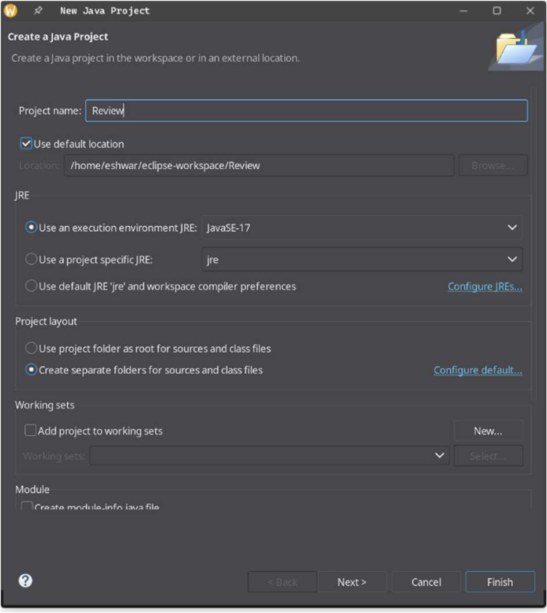

### 2. Creating the WordCount Class
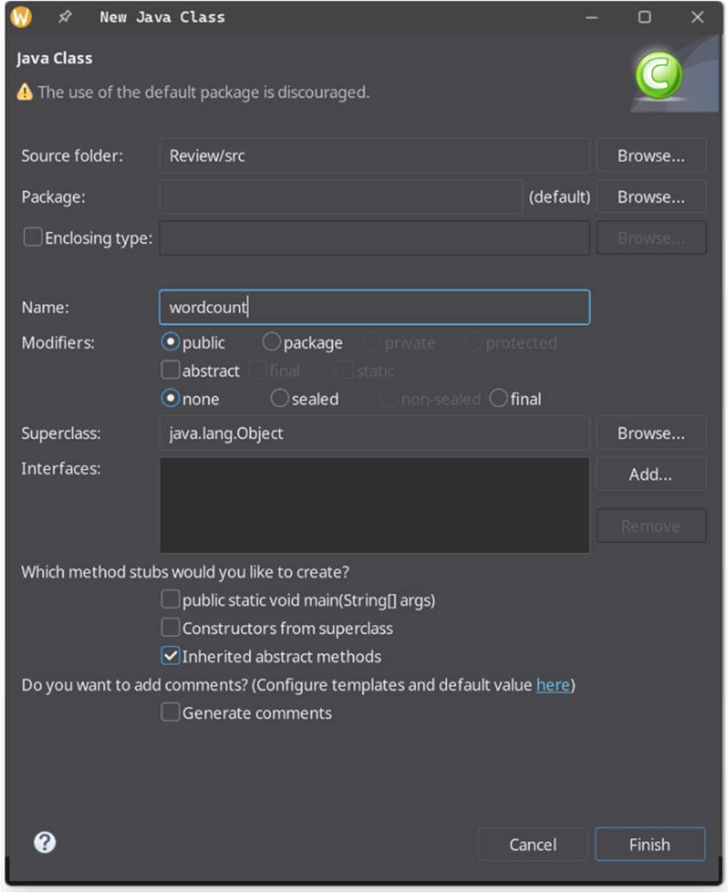

### 3. Adding Hadoop Libraries to Classpath
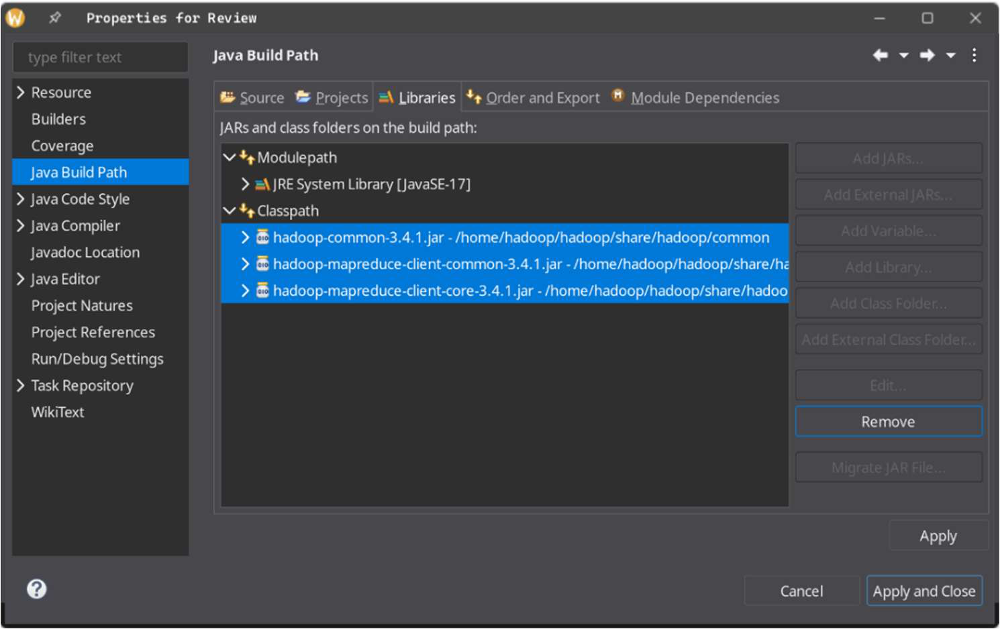

### 4. MapReduce Code in Eclipse IDE
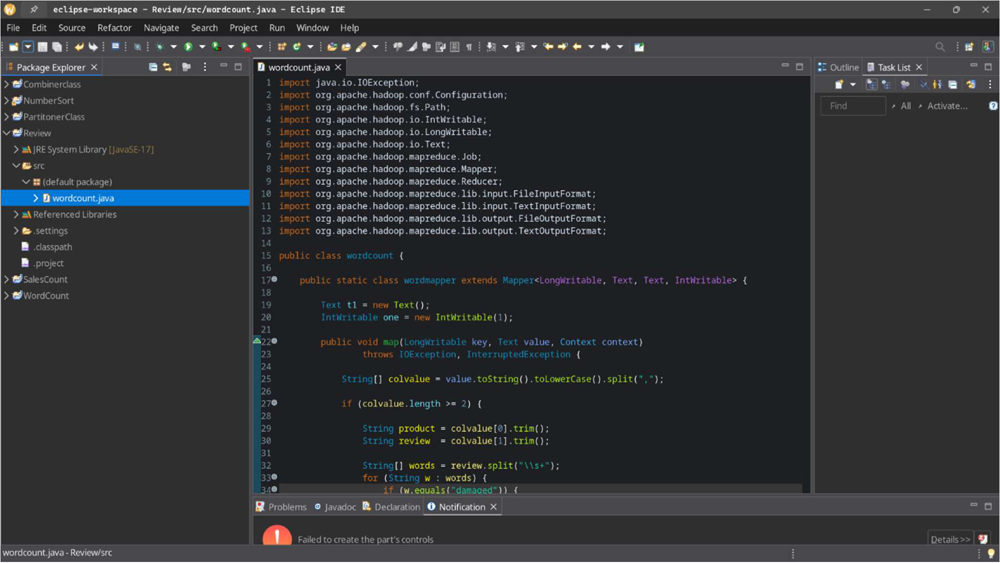

### 5. Exporting JAR File
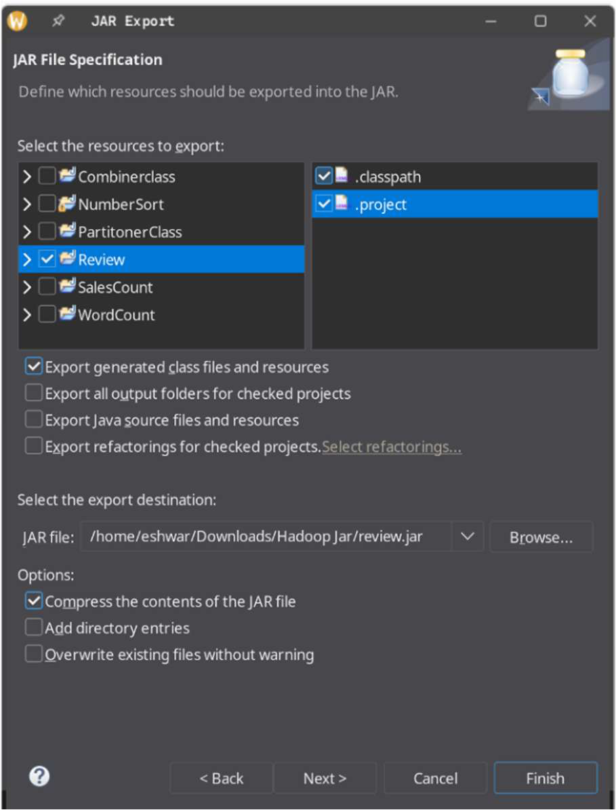

### 6. Starting Hadoop & Checking JPS
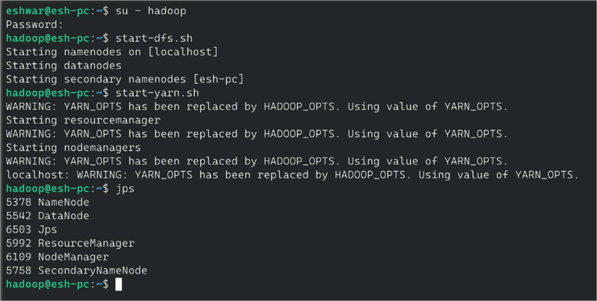

### 7. HDFS Input Directory & Data
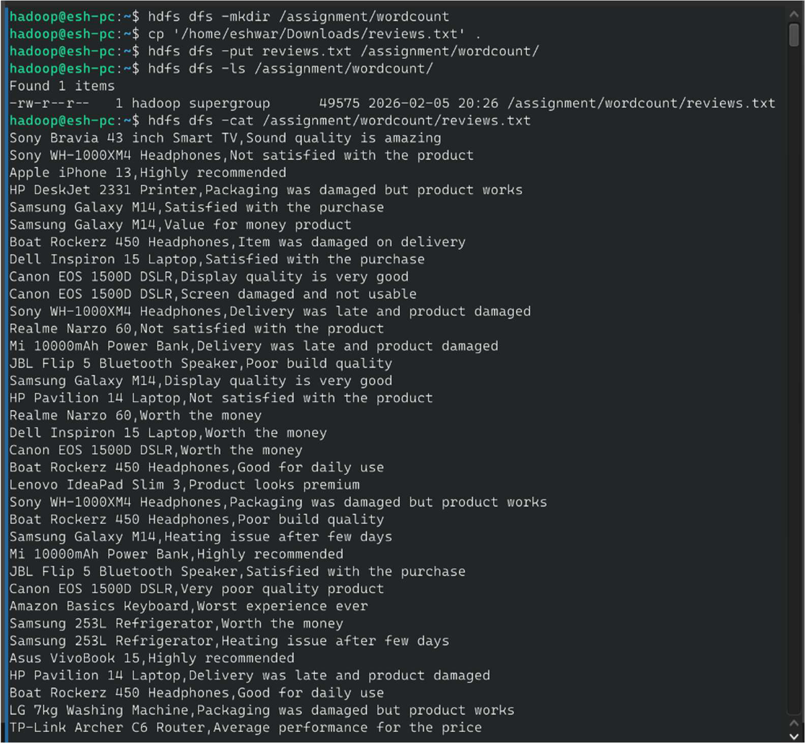

### 8. MapReduce Job Execution
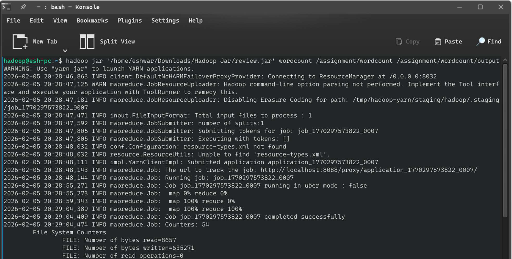

### 9. Job Counters & Statistics
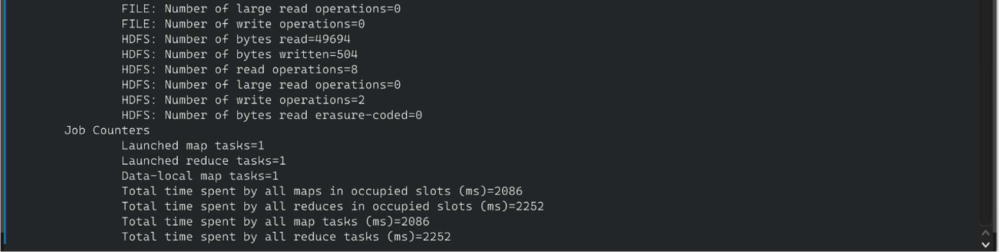

### 10. Output Directory Listing
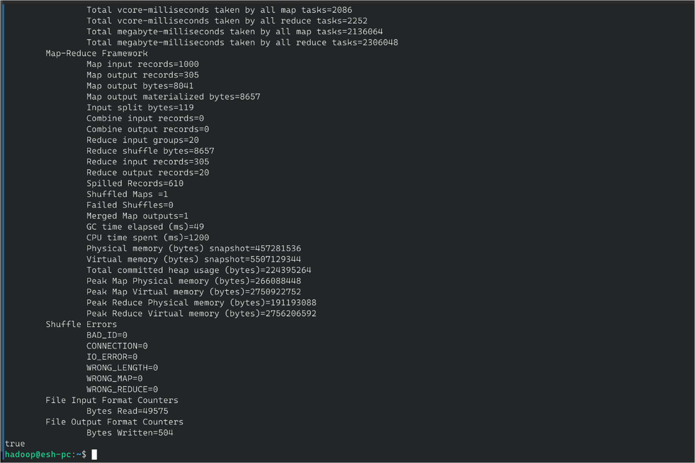

### 11. Final Output — Damaged Review Counts per Product
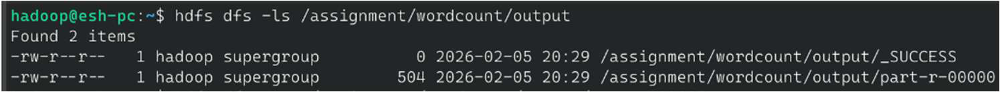

### 12. Full Output View
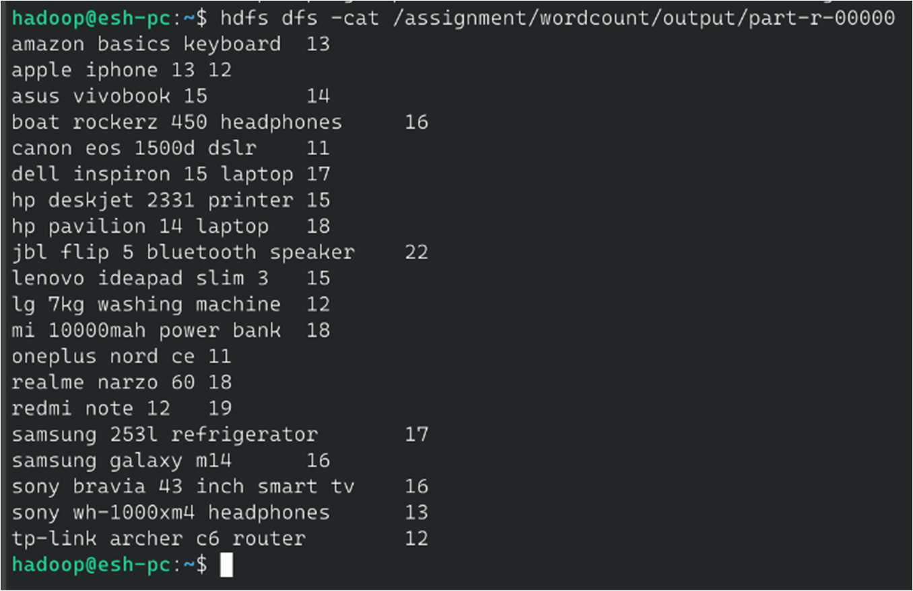

### 13. Saving Output to Local Filesystem
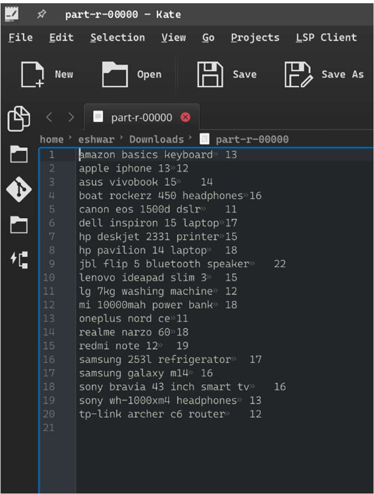

### 14. Output File in Local Filesystem
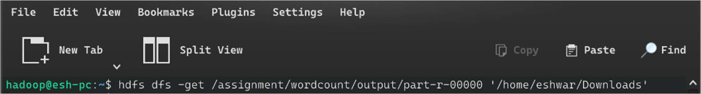

### 15. Output File Contents (Kate Editor)
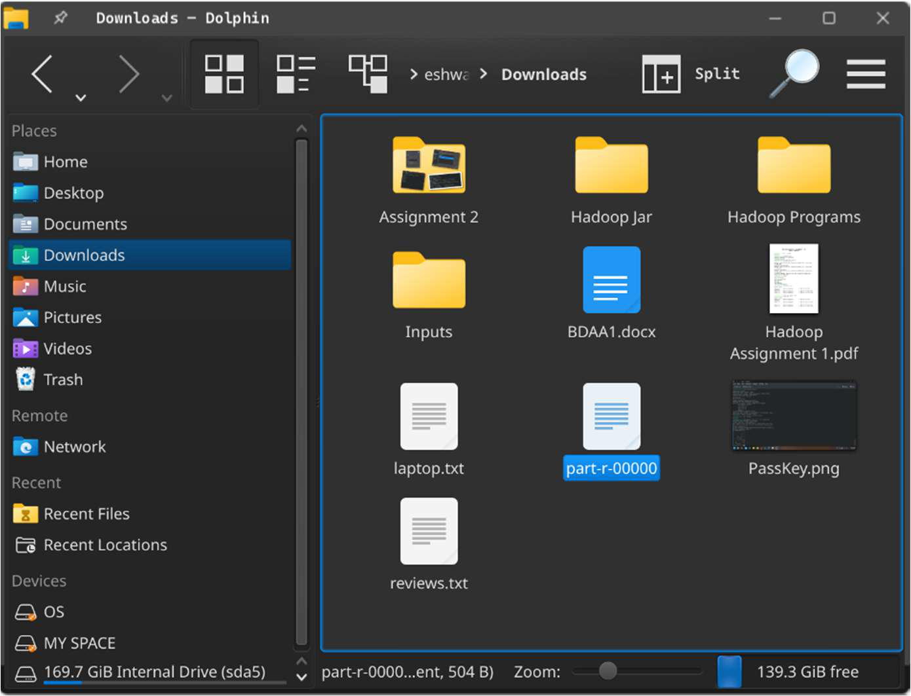

### 16. Stopping Hadoop Services
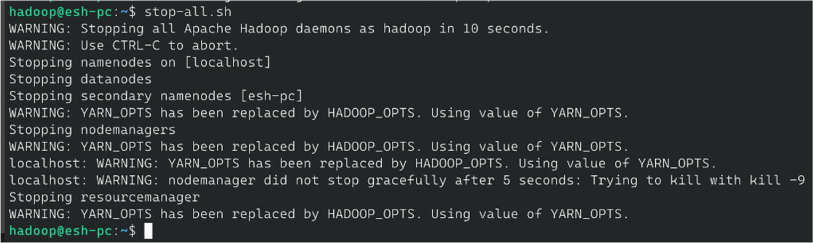


## 📤 Output Explanation

```
amazon basics keyboard          13
apple iphone 13                 12
asus vivobook 15                14
boat rockerz 450 headphones     16
jbl flip 5 bluetooth speaker    22   ← Most damaged complaints
dell inspiron 15 laptop         17
hp pavilion 14 laptop           18
mi 10000mah power bank          18
redmi note 12                   19
samsung 253l refrigerator       17
```

**Key Insights:**
- 🔴 **JBL Flip 5 Bluetooth Speaker** — 22 damage mentions (highest) → possible packaging issue.
- 🟡 **Redmi Note 12** — 19 mentions → delivery handling concern.
- 🟢 **OnePlus Nord CE** — 11 mentions (lowest) → better packaging.

This data can feed into a quality dashboard or automated vendor alert system.

---

## 📈 Scalability Explanation

| Scale | Approach |
|---|---|
| **1K records** (demo) | Single-node pseudo-distributed mode |
| **1M records** | Add 5–10 DataNodes, increase reducers |
| **1B records** | Full multi-node cluster, YARN resource tuning |
| **Streaming** | Replace batch job with Kafka + Spark Streaming |

The MapReduce model scales **linearly** — doubling cluster nodes roughly halves processing time.

---

## 🎓 Learning Outcomes

- ✅ Implemented full Hadoop MapReduce pipeline in Java.
- ✅ Understood HDFS read/write operations via CLI.
- ✅ Practised JAR packaging and job submission with `hadoop jar`.
- ✅ Analysed MapReduce counters and job metrics.
- ✅ Applied distributed computing to a real e-commerce analytics problem.

---

## 🔮 Future Improvements

- 🔍 Extend keyword matching to a configurable list (broken, cracked, defective).
- 📅 Add time-series analysis by parsing review timestamps.
- 📊 Visualise output with Apache Zeppelin or Tableau.
- ⚡ Migrate to Apache Spark for 10–100× faster processing.
- 🌐 Integrate with a REST API to expose damage metrics in real-time.

---

## 👥 Authors

| Name | Roll No | Program |
|---|---|---|
| **Eshwar G** | 2582420 | MSDA — 3rd Trimester |
| **Shivani R** | — | MSDA — 3rd Trimester |

---

## 📄 License

```
MIT License — Free to use, modify, and distribute with attribution.
```
