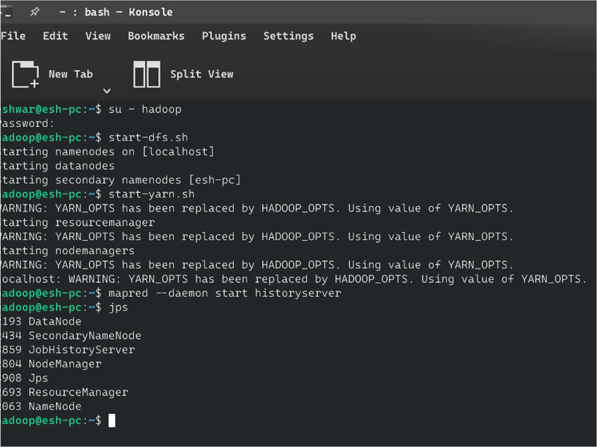
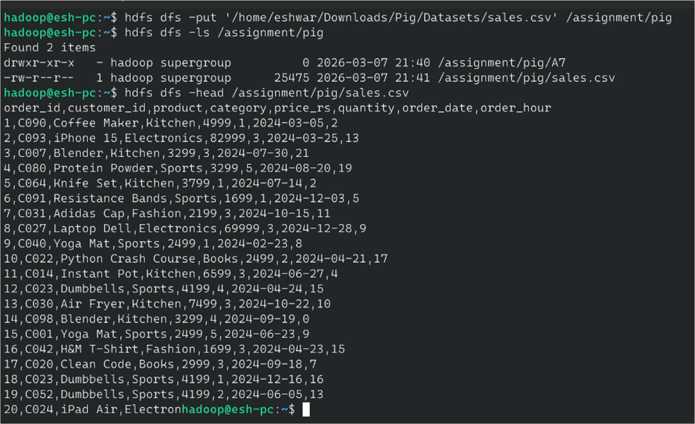
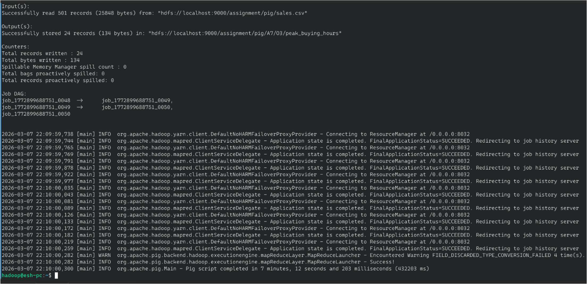
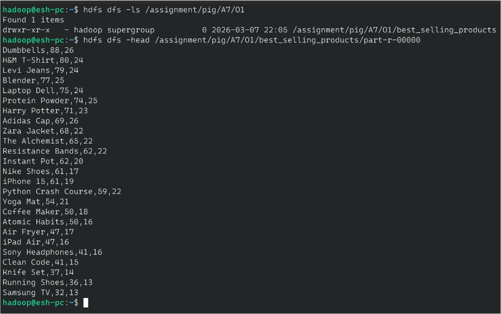
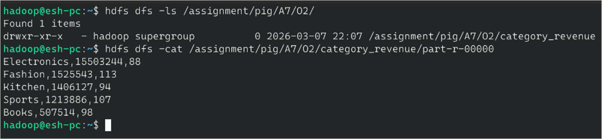
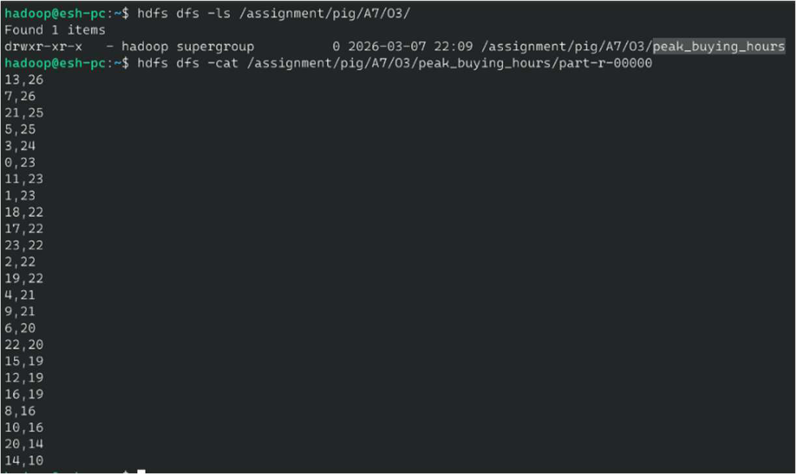

# 🛍️ E-Commerce Sales Analysis — Apache Pig on Hadoop


---

## 📌 Overview

This project uses **Apache Pig** on Hadoop to perform comprehensive e-commerce sales analytics on 500 transaction records. The Pig Latin script executes three distinct analytical pipelines in a single job, producing business insights around **product popularity**, **category revenue**, and **peak buying hours** — all stored as separate HDFS output directories.

Apache Pig's high-level dataflow language abstracts the complexity of raw MapReduce, enabling analysts to express multi-step transformations concisely without writing Java code.

---

## 🎯 Objective

- Load and filter 500 e-commerce sales records using Apache Pig.
- **Analysis 1:** Rank products by total units sold (best-sellers).
- **Analysis 2:** Compute category-wise revenue (price × quantity).
- **Analysis 3:** Identify peak buying hours for targeted promotions.
- Store all three outputs to separate HDFS directories.
- Demonstrate Pig Latin operators: `LOAD`, `FILTER`, `GROUP`, `FOREACH`, `ORDER`, `STORE`, `DUMP`.

---

## 🌐 Real-World Use Case

| Business Question | Pig Analysis |
|---|---|
| 📦 Which products should we stock more of? | Analysis 1 — Best-sellers by quantity |
| 💰 Which categories generate most revenue? | Analysis 2 — Category revenue ranking |
| ⏰ When should we send push notifications? | Analysis 3 — Peak buying hours |
| 🎯 Which products to promote in flash sales? | Analysis 1 (volume) + Analysis 2 (revenue gap) |
| 📊 Executive KPI dashboard | All three outputs combined |

---

## 🛠️ Technologies Used

| Technology | Version | Purpose |
|---|---|---|
| Apache Hadoop | 3.4.1 | HDFS storage + YARN execution |
| Apache Pig | 0.17 | High-level dataflow processing |
| Pig Latin | — | Script language for data transformations |
| HDFS | 3.4.1 | Distributed input/output |
| PigStorage | built-in | CSV reading and writing |

---

## 🧠 Hadoop Ecosystem Concepts

- **Apache Pig** — Dataflow language on top of MapReduce; compiles Pig Latin to MR jobs.
- **PigStorage** — Built-in loader/storer for delimited text files.
- **LOAD / STORE** — HDFS read and write with schema definition.
- **GROUP BY** — Aggregate records by a column value.
- **FOREACH GENERATE** — Column projection and computed fields.
- **ORDER BY DESC** — Global sort across the dataset.
- **DUMP** — Print results to console (for interactive testing).
- **Job DAG** — Pig optimises multi-step scripts into a directed acyclic graph of MR jobs.

---

## 📂 Repository Structure

```
ECommerce-Sales-Analysis-Apache-Pig/
├── src/
│   └── analysis.pig              # Complete Pig Latin script (3 analyses)
├── data/
│   └── sales.csv                 # 500 e-commerce transaction records
├── output/
│   ├── best_selling_products.txt # Analysis 1 output
│   ├── category_revenue.txt      # Analysis 2 output
│   └── peak_buying_hours.txt     # Analysis 3 output
├── screenshots/
│   ├── hdfs_upload.png           # sales.csv in HDFS
│   ├── pig_execution.png         # Pig script execution logs
│   ├── output_bestsellers.png    # Analysis 1 results
│   ├── output_revenue.png        # Analysis 2 results
│   └── output_peakhours.png      # Analysis 3 results
└── run_pig_job.sh
```

---

## 📋 Dataset Explanation

| Column | Type | Description | Example |
|---|---|---|---|
| `order_id` | INT | Unique order identifier | 1 |
| `customer_id` | STRING | Customer code | C090 |
| `product` | STRING | Product name | Coffee Maker |
| `category` | STRING | Product category | Kitchen |
| `price_rs` | INT | Unit price in rupees | 4999 |
| `quantity` | INT | Units ordered | 1 |
| `order_date` | STRING | Order date (YYYY-MM-DD) | 2024-03-05 |
| `order_hour` | INT | Hour of order (0–23) | 13 |

**Categories:** Electronics, Kitchen, Sports, Fashion, Books (5 categories, 500 records)

---

## 🏗️ Architecture / Workflow

```
sales.csv (HDFS)
      │
      ▼ LOAD + FILTER
   sales (relation)
      │
      ├─────────────────────────────────────────┐
      │                                         │
      ▼                                         ▼
GROUP BY product                         GROUP BY order_hour
      │                                         │
FOREACH GENERATE                          FOREACH GENERATE
(SUM qty, COUNT orders)                  (COUNT orders)
      │                                         │
ORDER BY total_qty DESC              ORDER BY total_orders DESC
      │                                         │
STORE → O1/best_selling_products     STORE → O3/peak_buying_hours

      ├────────────────────────────────────────────┐
      │                                            │
      ▼                                            │
FOREACH (price×qty AS revenue)                     │
      │                                            │
GROUP BY category                                  │
      │                                            │
FOREACH GENERATE (SUM revenue, COUNT)              │
      │                                            │
ORDER BY total_revenue DESC                        │
      │                                            │
STORE → O2/category_revenue ────────────────────────┘
```

---

## 💻 Code Explanation

### Loading Data with Schema

```pig
sales_raw = LOAD 'hdfs://localhost:9000/assignment/pig/sales.csv'
    USING PigStorage(',')
    AS (order_id:int, customer_id:chararray, product:chararray,
        category:chararray, price_rs:int, quantity:int,
        order_date:chararray, order_hour:int);

sales = FILTER sales_raw BY order_id IS NOT NULL AND order_id != 0;
```

### Analysis 1 — Best-Selling Products

```pig
grouped_products    = GROUP sales BY product;
product_sales       = FOREACH grouped_products GENERATE
                         group              AS product,
                         SUM(sales.quantity) AS total_quantity,
                         COUNT(sales)        AS total_orders;
best_selling_products = ORDER product_sales BY total_quantity DESC;
STORE best_selling_products INTO '...O1/best_selling_products' USING PigStorage(',');
```

### Analysis 2 — Category Revenue

```pig
sales_with_revenue  = FOREACH sales GENERATE category, (price_rs * quantity) AS revenue_rs;
grouped_category    = GROUP sales_with_revenue BY category;
category_revenue    = FOREACH grouped_category GENERATE
                         group                              AS category,
                         SUM(sales_with_revenue.revenue_rs) AS total_revenue_rs,
                         COUNT(sales_with_revenue)          AS total_orders;
sorted_category_revenue = ORDER category_revenue BY total_revenue_rs DESC;
```

### Analysis 3 — Peak Hours

```pig
grouped_hours  = GROUP sales BY order_hour;
hourly_orders  = FOREACH grouped_hours GENERATE
                     group        AS hour,
                     COUNT(sales) AS total_orders;
peak_hours     = ORDER hourly_orders BY total_orders DESC;
```

---

## 🚀 Step-by-Step Execution

### Step 1 — Start Hadoop + History Server

```bash
su - hadoop
start-dfs.sh && start-yarn.sh
mapred --daemon start historyserver
jps
```

### Step 2 — Upload Dataset to HDFS

```bash
hdfs dfs -mkdir -p /assignment/pig
hdfs dfs -put data/sales.csv /assignment/pig/
hdfs dfs -ls /assignment/pig
hdfs dfs -head /assignment/pig/sales.csv
```

### Step 3 — Run Pig Script

```bash
pig ~/Downloads/Pig/analysis.pig
# OR in local mode for testing:
pig -x local src/analysis.pig
```

### Step 4 — Verify Outputs

```bash
# Analysis 1
hdfs dfs -ls /assignment/pig/A7/O1
hdfs dfs -cat /assignment/pig/A7/O1/best_selling_products/part-r-00000

# Analysis 2
hdfs dfs -cat /assignment/pig/A7/O2/category_revenue/part-r-00000

# Analysis 3
hdfs dfs -cat /assignment/pig/A7/O3/peak_buying_hours/part-r-00000
```

---

## 📸 Screenshots

### 1. Uploading sales.csv to HDFS


### 2. Pig Script Execution (Job DAG)


### 3. Pig Script Completed Successfully


### 4. Output 1 — Best Selling Products by Quantity


### 5. Output 2 — Category Revenue Ranking


### 6. Output 3 — Peak Buying Hours



## 📤 Output Explanation

### Analysis 1: Best-Selling Products
```
Dumbbells,88,26        ← 88 units across 26 orders — top seller
H&M T-Shirt,80,24
Levi Jeans,79,24
Blender,77,25
Laptop Dell,75,24
Protein Powder,74,25
Harry Potter,71,23
Adidas Cap,69,26
```
**Insight:** Affordable everyday items (Dumbbells, T-shirts, Jeans) outsell premium electronics in volume.

### Analysis 2: Category Revenue
```
Electronics,15503244,88   ← ₹1.55 Cr despite fewer orders — high unit price
Fashion,1525543,113
Kitchen,1406127,94
Sports,1213886,107
Books,507514,98           ← Lowest revenue despite 98 orders
```
**Insight:** Electronics drives revenue despite lower order count. Books need bundling strategies.

### Analysis 3: Peak Buying Hours
```
13,26    ← 1 PM — highest orders (lunch break shopping)
7,25     ← 7 AM — early morning commuters
21,25    ← 9 PM — evening shoppers
5,25
```
**Insight:** Schedule flash sales and push notifications at 1 PM and 9 PM for maximum reach.

---

## 📈 Scalability

| Data Volume | Pig Advantage |
|---|---|
| 500 records | Single-node demo |
| 50M records | Pig auto-generates optimised MR DAG |
| 500M records | Tez execution engine (set `pig.exectype=tez`) |
| Streaming | Pig on Spark mode for near-real-time |

---

## 🎓 Learning Outcomes

- ✅ Wrote Pig Latin scripts for multi-step data analysis.
- ✅ Used `GROUP BY`, `FOREACH`, `ORDER BY` for aggregation and ranking.
- ✅ Computed derived fields (revenue = price × quantity) inline.
- ✅ Stored multiple outputs from a single Pig script run.
- ✅ Interpreted business insights from e-commerce analytics.

---

## 🔮 Future Improvements

- 📅 Add monthly revenue trend using `order_date` parsing.
- 👤 Customer segmentation (RFM analysis) using `customer_id`.
- 🤝 Join with a product catalog for category metadata enrichment.
- 📊 Visualize outputs with Apache Zeppelin + Pig notebook.
- ⚡ Migrate to Spark SQL for faster execution and richer analytics.

---

## 👥 Authors

| Name | Roll No | Program |
|---|---|---|
| **Eshwar G** | 2582420 | MSDA — 3rd Trimester |
| **Shivani R** | — | MSDA — 3rd Trimester |

---

## 📄 License

MIT License — Free to use, modify, and distribute with attribution.
