# 🎬 Movies & Directors Analytics — Apache Hive on Hadoop


---

## 📌 Overview

This project demonstrates **Apache Hive** — the SQL-on-Hadoop data warehouse — using a Movies and Directors dataset. The project covers Hive's core production features: **Partitioning**, **Bucketing**, **ORC storage**, **HiveQL aggregations**, **partition pruning**, **sampling**, and **JOIN queries** — all against a 30-movie, 6-genre Indian and Hollywood film dataset.

Apache Hive translates HiveQL queries into optimised MapReduce or Tez jobs, enabling analysts familiar with SQL to query petabyte-scale data without writing Java MapReduce code.

---

## 🎯 Objective

- Create a **partitioned + bucketed** Hive table for efficient analytical queries.
- Load movie data by genre into **separate HDFS partition directories**.
- Execute **partition pruning** queries that scan only relevant partitions.
- Perform **bucketing sampling** for statistical analysis.
- Compute **average rating and revenue** aggregations by genre.
- Identify **top-grossing movies** per genre.
- Execute a **JOIN query** between movies and directors tables.
- Demonstrate Hive's SQL-like interface over Hadoop's distributed storage.

---

## 🌐 Real-World Use Case

| Scenario | Hive Application |
|---|---|
| 🎬 OTT Platforms | Recommend top-rated movies by genre for users |
| 💰 Box Office Analytics | Revenue vs budget ROI analysis for studios |
| 🌍 Market Research | Language-wise audience segmentation |
| 🏆 Award Predictions | Statistical modeling from rating/revenue patterns |
| 📊 Content Strategy | Identify underperforming genres for content gaps |

---

## 🛠️ Technologies Used

| Technology | Version | Purpose |
|---|---|---|
| Apache Hadoop | 3.4.1 | HDFS + YARN execution layer |
| Apache Hive | 4.0.1 | SQL-on-Hadoop warehouse |
| HiveQL | — | SQL-like query language |
| ORC Format | — | Optimised columnar storage for analytics |
| Beeline | 4.0.1 | CLI client for HiveServer2 |
| JDBC | — | Hive connection protocol |

---

## 🧠 Hadoop Ecosystem Concepts

| Concept | Description |
|---|---|
| **Partitioning** | Divides table into HDFS subdirectories by column value (genre). Queries with `WHERE genre = 'X'` skip all other partitions. |
| **Bucketing** | Splits data within partitions into fixed-size files using hash(movie_id). Enables efficient sampling and JOIN optimisation. |
| **ORC Storage** | Optimised Row Columnar format — compression + predicate pushdown for fast aggregations. |
| **Partition Pruning** | Hive reads ONLY the relevant partition directories, avoiding full table scans. |
| **TABLESAMPLE** | Reads a subset of buckets for statistical sampling without processing all data. |
| **HiveServer2 + Beeline** | Production-grade JDBC interface for concurrent multi-user access. |
| **Dynamic Partitioning** | `INSERT OVERWRITE ... PARTITION (genre)` automatically routes rows to correct partitions. |

---

## 📂 Repository Structure

```
Movies-Analytics-Apache-Hive/
├── src/
│   └── movies_analytics.hql          # Complete HiveQL script (10 query steps)
├── data/
│   ├── movies.csv                    # 30 movies across 6 genres
│   └── directors.csv                 # 30 director records
├── output/
│   ├── partition_pruning_output.txt  # Action movies sorted by revenue
│   ├── bucketing_sample.txt          # Bucket 1 sample output
│   ├── avg_rating_revenue.txt        # Genre-wise aggregations
│   ├── top_grossing_movies.txt       # Top movie per genre
│   └── movies_with_directors.txt     # JOIN query results (top 10)
├── screenshots/
│   ├── hive_start.png                # Beeline / Hive CLI startup
│   ├── database_creation.png         # CREATE DATABASE output
│   ├── partitioned_table.png         # Partitioned + bucketed table DDL
│   ├── partition_insert.png          # Partition INSERT execution
│   ├── hdfs_partitions.png           # HDFS directory structure
│   ├── partition_pruning.png         # Partition pruning query output
│   ├── bucketing.png                 # TABLESAMPLE output
│   ├── avg_rating_revenue.png        # Aggregation query output
│   ├── top_grossing.png              # Top-grossing movies output
│   └── join_output.png               # Movies + Directors JOIN output
└── run_hive_job.sh
```

---

## 📋 Dataset Explanation

### movies.csv — 30 Records, 6 Genres

| Column | Type | Description |
|---|---|---|
| movie_id | INT | Primary key |
| title | STRING | Movie title |
| genre | STRING | Action / Comedy / Drama / Sci-Fi / Historical / Thriller |
| release_year | INT | Year of release |
| language | STRING | Telugu / Hindi / English / Kannada / Tamil |
| rating | FLOAT | IMDb-style rating (1–10) |
| budget_cr | FLOAT | Production budget (₹ crores) |
| revenue_cr | FLOAT | Box office revenue (₹ crores) |

### directors.csv — 30 Records

| Column | Type | Description |
|---|---|---|
| director_id | INT | Primary key |
| movie_id | INT | Foreign key → movies.movie_id |
| director_name | STRING | Director's full name |
| nationality | STRING | Country of origin |

---

## 🏗️ Architecture / Workflow

```
movies.csv ──► movies_staging (TEXTFILE)
                        │
                        │ INSERT INTO PARTITION
                        ▼
              movies (ORC, Partitioned + Bucketed)
              ┌──────────────────────────────────────┐
              │  HDFS: /user/hive/warehouse/movies.db │
              │  ├── genre=Action/                    │
              │  │   ├── bucket_0.orc                 │
              │  │   ├── bucket_1.orc                 │
              │  │   ├── bucket_2.orc                 │
              │  │   └── bucket_3.orc                 │
              │  ├── genre=Comedy/                    │
              │  ├── genre=Drama/                     │
              │  ├── genre=Sci-Fi/                    │
              │  ├── genre=Historical/                │
              │  └── genre=Thriller/                  │
              └──────────────────────────────────────┘
                        │
           ┌────────────┼──────────────────────────┐
           │            │                          │
    Partition       Bucketing              JOIN with
    Pruning         Sampling               directors
    (genre filter)  (TABLESAMPLE)         (movie_id)
           │            │                          │
     Action movies   25% sample            Top-10 movies
     by revenue DESC  of movies            with directors
```

---

## 💻 Code Explanation

### Creating Partitioned + Bucketed Table

```sql
CREATE TABLE movies (
    movie_id INT, title STRING, release_year INT,
    language STRING, rating FLOAT, budget_cr FLOAT, revenue_cr FLOAT
)
PARTITIONED BY (genre STRING)           -- One HDFS dir per genre
CLUSTERED BY (movie_id) INTO 4 BUCKETS -- Hash-based file splits
STORED AS ORC;                          -- Columnar format
```

### Partition Insert

```sql
INSERT INTO TABLE movies PARTITION (genre='Action')
SELECT movie_id, title, release_year, language, rating, budget_cr, revenue_cr
FROM movies_staging WHERE genre = 'Action';
```

### Partition Pruning — Reads ONLY the Action directory

```sql
SELECT title, release_year, rating, revenue_cr
FROM movies
WHERE genre = 'Action'          -- ← Hive skips all other partitions
ORDER BY revenue_cr DESC;
```

### Bucketing Sampling

```sql
SELECT movie_id, title, genre
FROM movies
TABLESAMPLE(BUCKET 1 OUT OF 4 ON movie_id);  -- Read 25% of data
```

### Genre Aggregations

```sql
SELECT genre,
       ROUND(AVG(rating),     2) AS avg_rating,
       ROUND(AVG(revenue_cr), 2) AS avg_revenue_cr,
       COUNT(*)                   AS total_movies
FROM movies
GROUP BY genre
ORDER BY avg_revenue_cr DESC;
```

### Movies with Directors JOIN

```sql
SELECT m.title, m.genre, m.rating, m.release_year, m.revenue_cr,
       d.director_name, d.nationality
FROM movies m
JOIN directors d ON m.movie_id = d.movie_id
ORDER BY m.rating DESC
LIMIT 10;
```

---

## 🚀 Step-by-Step Execution

### Step 1 — Start Apache Hive

```bash
su - hadoop
start-dfs.sh && start-yarn.sh
hive    # OR: beeline -u jdbc:hive2://
```

### Step 2 — Configure Dynamic Partitioning

```sql
SET hive.exec.dynamic.partition = true;
SET hive.exec.dynamic.partition.mode = nonstrict;
SET hive.enforce.bucketing = true;
```

### Step 3 — Create Database and Tables

```sql
CREATE DATABASE IF NOT EXISTS movies;
USE movies;
-- Run the staging table DDL and LOAD command
```

### Step 4 — Run Full HiveQL Script

```bash
beeline -u jdbc:hive2:// -f src/movies_analytics.hql
# OR inside Hive CLI:
hive> source /home/eshwar/Downloads/A8/movies_analytics.hql;
```

### Step 5 — Verify HDFS Partition Directories

```bash
hdfs dfs -ls /user/hive/warehouse/movies.db/movies
hdfs dfs -ls /user/hive/warehouse/movies.db/movies/genre=Action
```

---

## 📸 Screenshots

### 1. Starting Apache Hive (Beeline CLI)
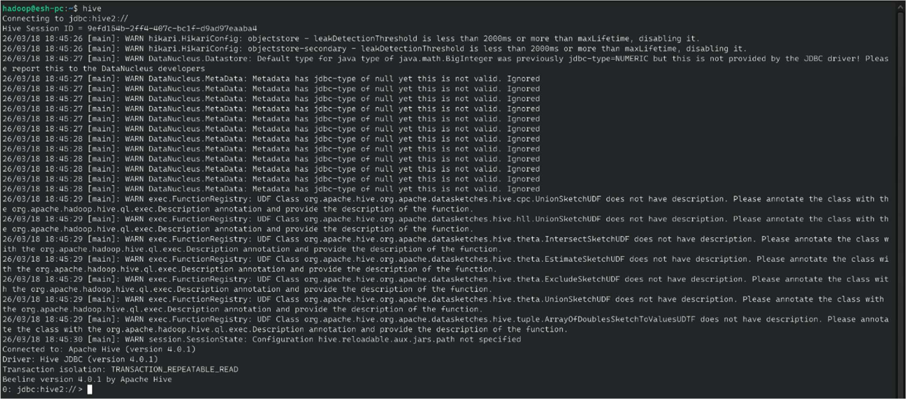

### 2. Creating the Movies Database
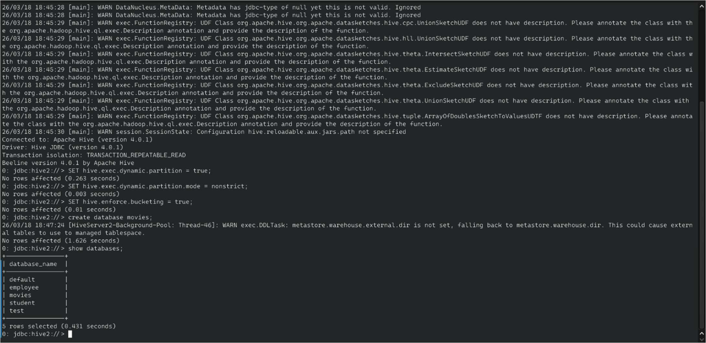

### 3. Creating Staging Table & Loading Data
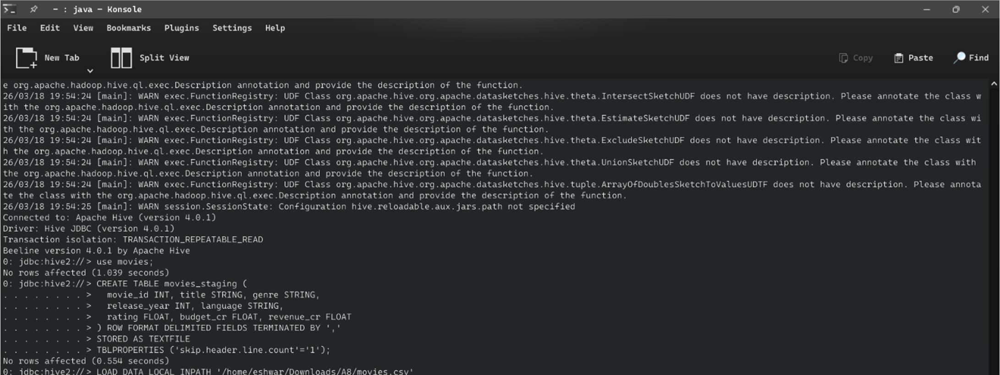

### 4. Creating Partitioned + Bucketed ORC Table
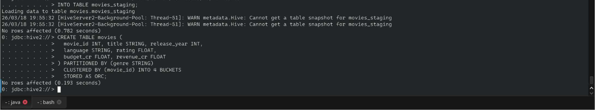

### 5. Partition INSERT Execution (Action genre)
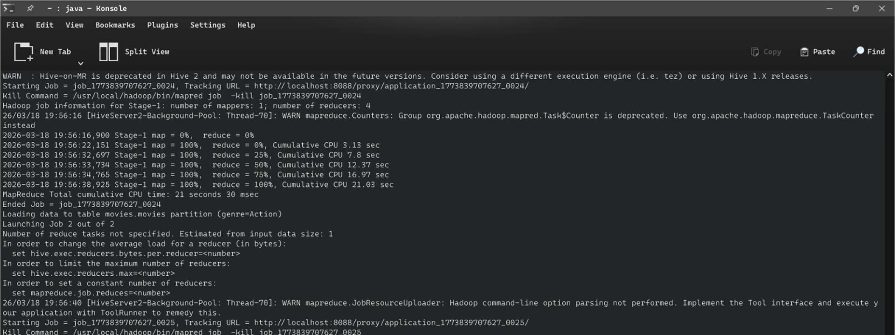

### 6. Partition INSERT Job Counters
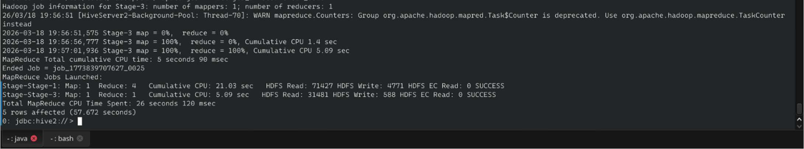

### 7. HDFS Partition Directories Verified
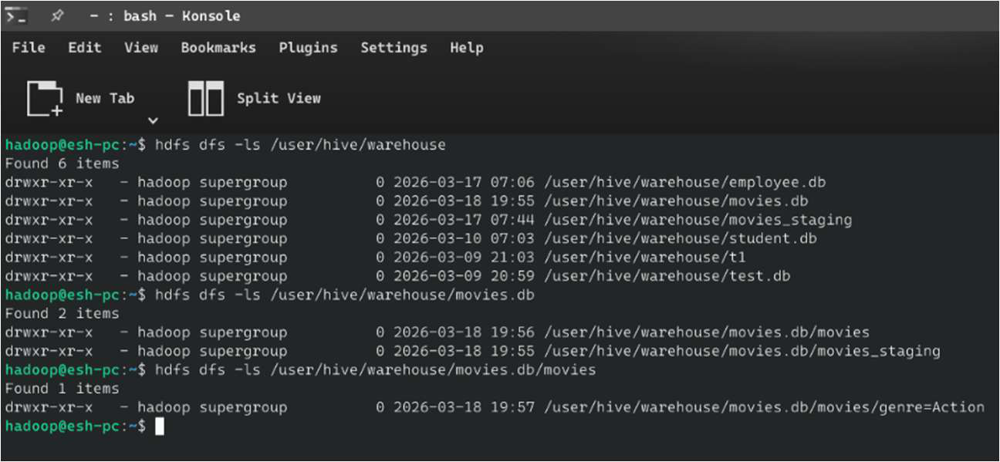

### 8. Partition Pruning Query — Action Movies by Revenue
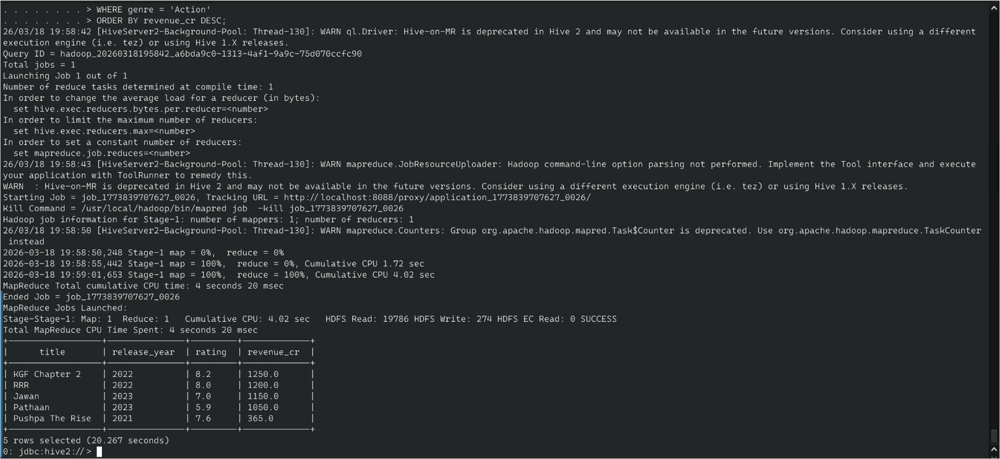

### 9. Bucketing TABLESAMPLE Query
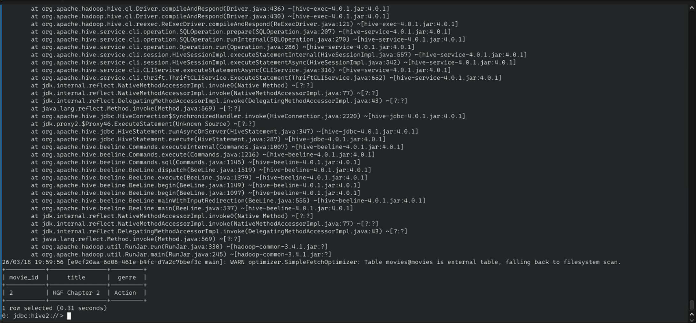

### 10. Average Rating & Revenue by Genre
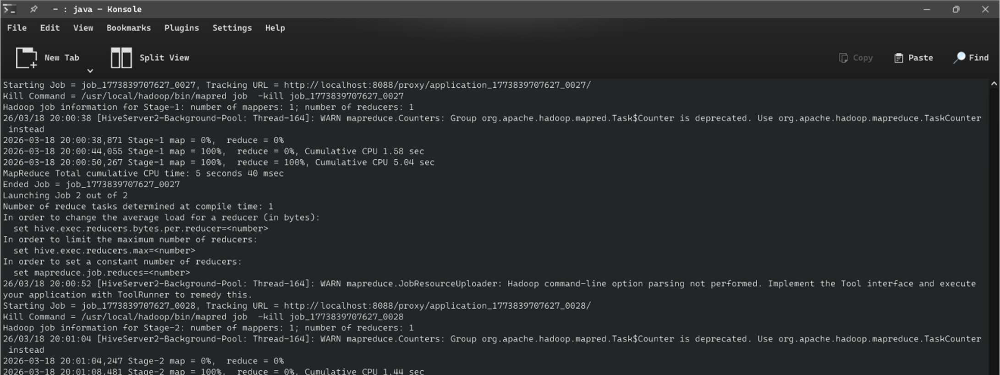

### 11. Top-Grossing Movie Query per Genre
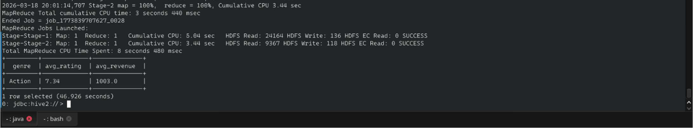

### 12. Top-Grossing Movie Results
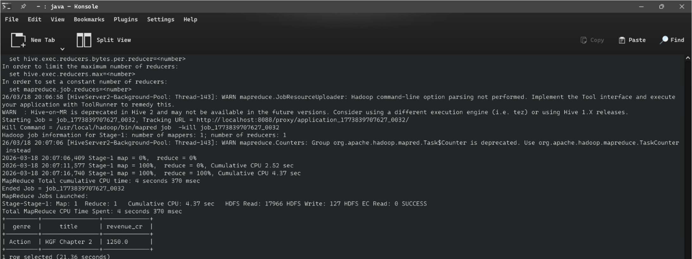

### 13. Directors Table & HDFS Verification
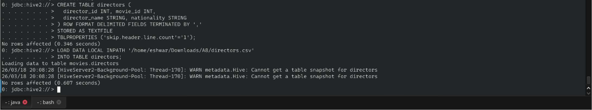

### 14. JOIN Query — Movies with Directors
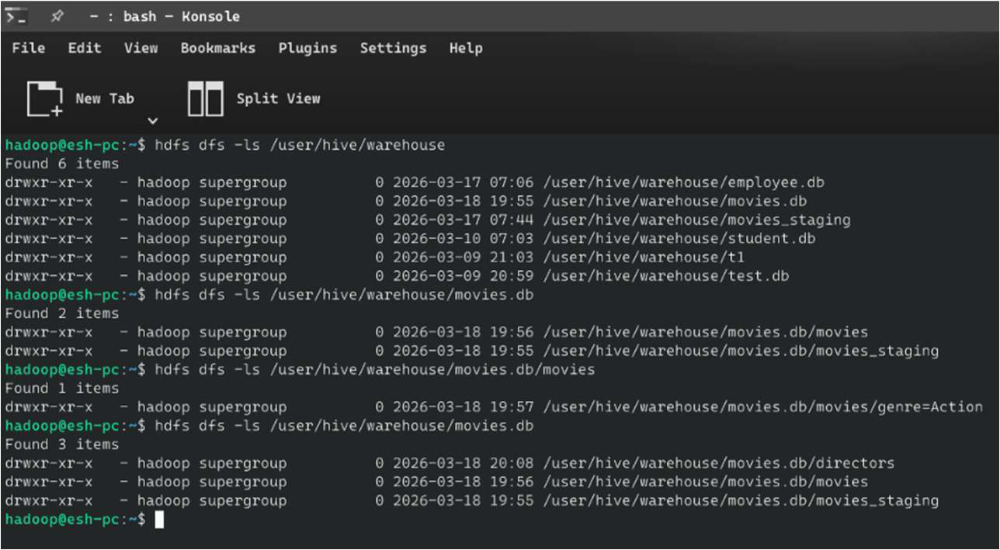

### 15. JOIN Output — Top 10 Movies with Directors
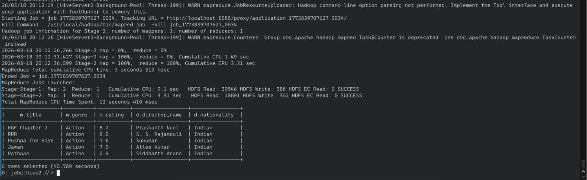


## 📤 Output Explanation

### Partition Pruning — Action Movies by Revenue

```
KGF Chapter 2    | 2022 | 8.2 | 1250.0   ← Highest grossing Action film
RRR              | 2022 | 8.0 | 1200.0
Jawan            | 2023 | 7.0 | 1150.0
Pathaan          | 2023 | 5.9 | 1050.0
Pushpa The Rise  | 2021 | 7.6 |  365.0
```

### Genre Aggregations

```
Sci-Fi      | 8.10 | 2672.0  ← Highest avg revenue (Interstellar effect)
Action      | 7.34 | 1003.0
Thriller    | 8.24 |  261.0
Historical  | 7.12 |  637.4
Comedy      | 7.94 |  141.8
Drama       | 8.18 |   60.0
```

**Insight:** Sci-Fi has the highest average revenue per movie, driven by Interstellar (₹4800 Cr). Action has consistent high revenue. Drama, despite strong ratings, has the lowest average revenue.

### Top-Grossing Movie per Genre

```
Sci-Fi      | Interstellar         | 4800.0
Action      | KGF Chapter 2        | 1250.0
Thriller    | Ratsasan             |  650.0
Historical  | Baahubali Conclusion |  585.0
Comedy      | 3 Idiots             |  460.0
Drama       | Baahubali Beginning  |  150.0
```

### Movies + Directors JOIN (Top 10 by Rating)

```
Interstellar       | Sci-Fi     | 8.6 | Christopher Nolan  | British
3 Idiots           | Comedy     | 8.4 | Rajkumar Hirani    | Indian
Taare Zameen Par   | Drama      | 8.4 | Aamir Khan         | Indian
Ratsasan           | Thriller   | 8.5 | Ram Kumar          | Indian
KGF Chapter 2      | Action     | 8.2 | Prashanth Neel     | Indian
```

---

## ⚡ Partitioning vs Bucketing Comparison

| Feature | Partitioning | Bucketing |
|---|---|---|
| Purpose | Divide table by column value | Divide data within partition |
| HDFS Structure | Separate directories | Fixed number of files |
| Query Benefit | Partition pruning (skip dirs) | Efficient JOIN + sampling |
| Column Type | Low-cardinality (genre) | High-cardinality (movie_id) |
| Data Distribution | Potentially uneven | Even (hash-based) |

---

## 📈 Scalability

| Table Size | Hive Advantage |
|---|---|
| 30 records (demo) | Single-node development |
| 10M movies | Partitioning reduces scan to 1/6 of data |
| 100M movies | ORC + predicate pushdown reduces I/O by 90%+ |
| Streaming | Hive + Kafka for near-real-time warehouse updates |

---

## 🎓 Learning Outcomes

- ✅ Created partitioned and bucketed Hive tables with ORC storage.
- ✅ Loaded data via staging table → partition INSERT pattern.
- ✅ Verified HDFS partition directory structure.
- ✅ Applied partition pruning for performance-optimised queries.
- ✅ Used TABLESAMPLE for efficient statistical sampling.
- ✅ Performed GROUP BY aggregations with ROUND and AVG.
- ✅ Executed JOIN between two Hive tables on a common key.

---

## 🔮 Future Improvements

- 🚀 Switch from MapReduce to **Tez engine** for 2–5× faster queries.
- 📊 Integrate with **Apache Zeppelin** for interactive HiveQL notebooks.
- 🌐 Add external tables over an **S3/GCS** data lake.
- 🤖 Add an ML pipeline with **Hive + Spark MLlib** for movie recommendation.
- 🔒 Implement **column-level masking** for sensitive budget data.

---

## Author

**Eshwar G**

---

## 📄 License

MIT License — Free to use, modify, and distribute with attribution.
