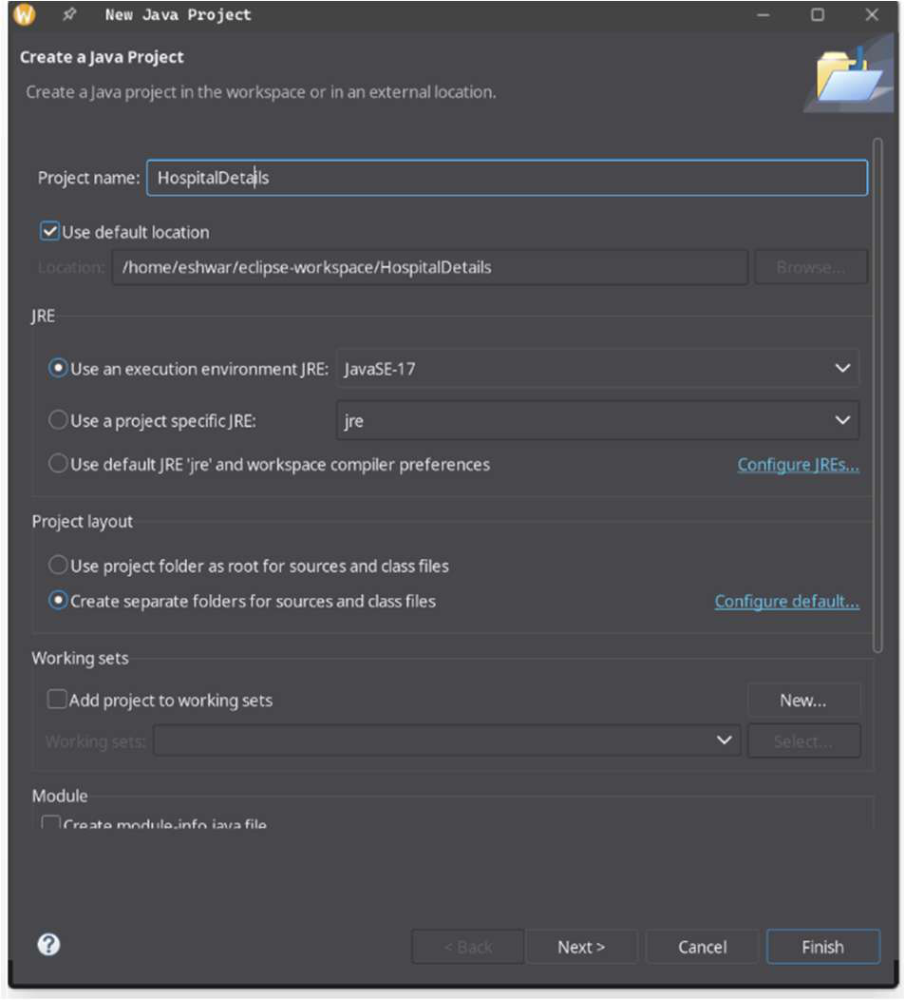
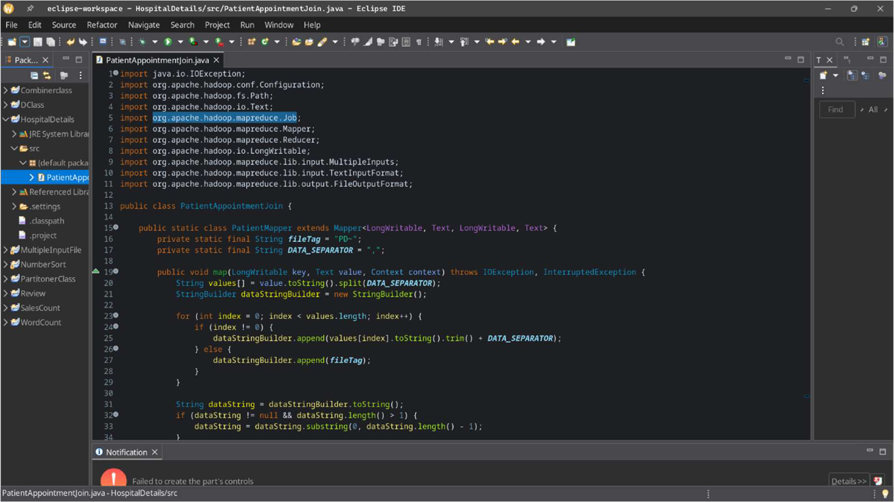
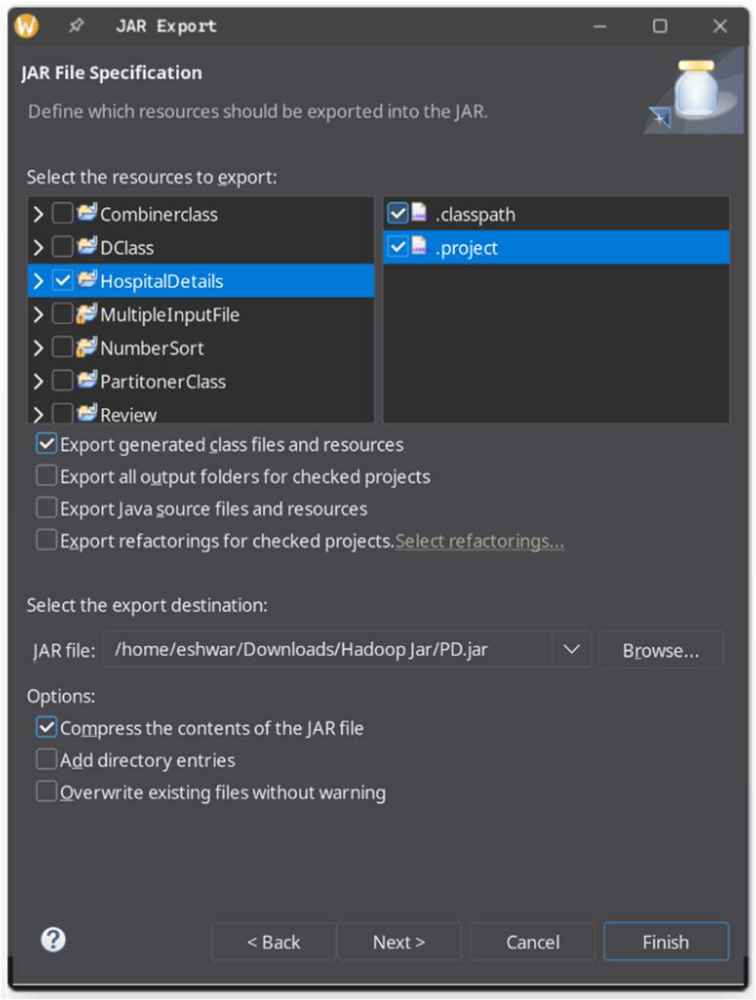
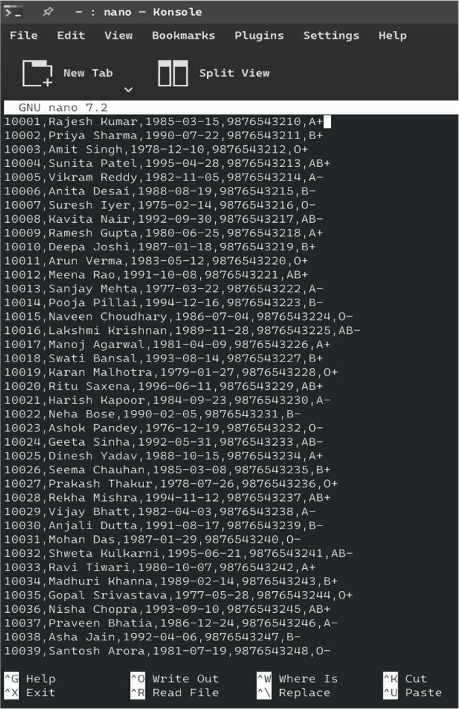
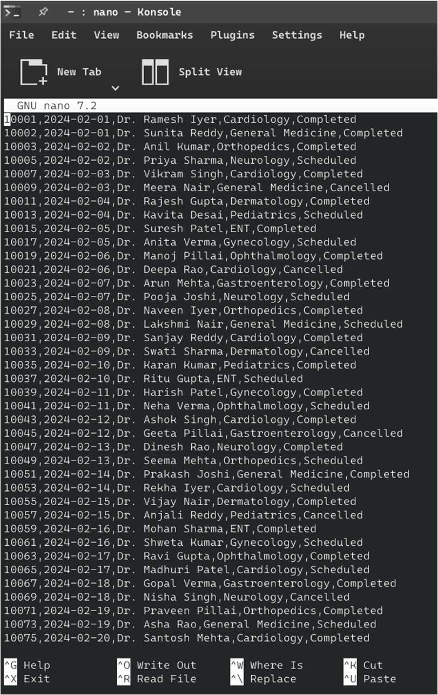
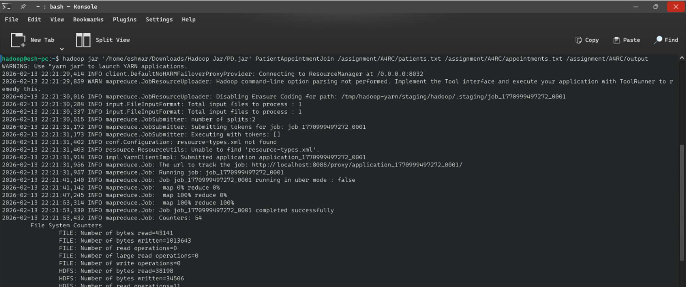
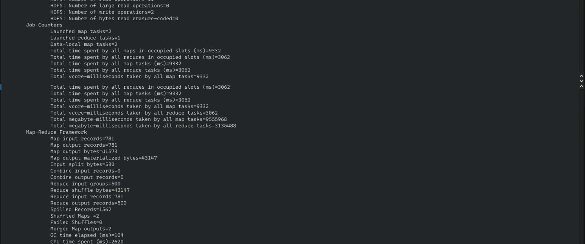
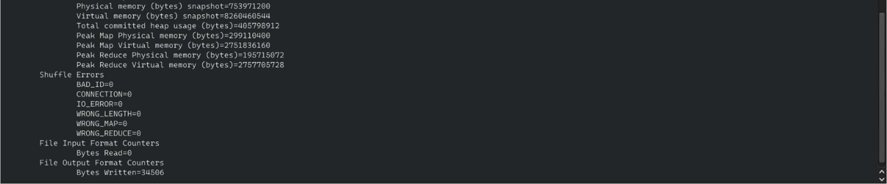
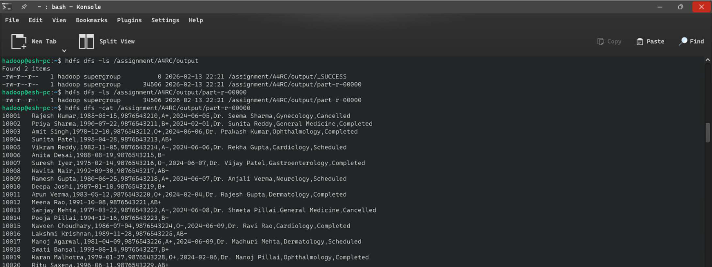
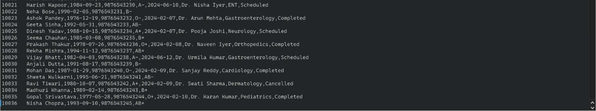

# 🏥 Patient Appointment Data Integration — Hadoop Reduce-Side Join


---

## 📌 Overview

This project implements a **Hadoop MapReduce Reduce-Side Join** to integrate two hospital datasets — **patient registration records** and **appointment scheduling records** — into a single unified healthcare database. By using `MultipleInputs`, each dataset is processed by a dedicated mapper, and joined at the reducer level using the patient ID as the common key.

This pattern mirrors real-world **hospital information system (HIS) integration pipelines** used by healthcare providers to consolidate patient demographics with clinical visit data.

---

## 🎯 Objective

- Implement the **Reduce-Side Join** pattern in Hadoop MapReduce.
- Integrate `patients.txt` (500 records) with `appointments.csv` (500+ records).
- Produce a unified output: complete patient profile + appointment history.
- Identify patients without appointments and orphaned appointment records.
- Demonstrate `MultipleInputs` for heterogeneous data source handling.

---

## 🌐 Real-World Use Case

| Healthcare Scenario | Application |
|---|---|
| 🩺 Doctor Consultations | Complete patient history at point-of-care |
| 💳 Billing & Insurance | Unified record for claim generation |
| 📊 Departmental Analytics | Appointment load per doctor/department |
| 🔔 Follow-up Campaigns | Identify registered patients with no visits |
| 🏥 Resource Allocation | Predict department workloads from appointment patterns |

---

## 🛠️ Technologies Used

| Technology | Purpose |
|---|---|
| Apache Hadoop 3.4.1 | Distributed data processing |
| Java 17 | MapReduce implementation |
| MultipleInputs API | Different mapper per input source |
| HDFS | Distributed storage for both datasets |
| YARN | Resource management |
| Eclipse IDE | Development environment |

---

## 🧠 Hadoop Ecosystem Concepts

- **Reduce-Side Join** — Join logic implemented in the reducer (most flexible join type).
- **MultipleInputs** — Allows separate Mapper classes for different input file formats.
- **Tagged Records** — Prefix `PD~` (patient) and `AD~` (appointment) for source identification.
- **LongWritable Keys** — Patient ID as the join key across both datasets.
- **Outer Join Logic** — Output includes records even when only one side has data.

---

## 📂 Repository Structure

```
Patient-Appointment-Data-Integration/
├── src/
│   └── PatientAppointmentJoin.java   # PatientMapper, AppointmentMapper, Reducer, Driver
├── data/
│   ├── patients.txt                  # 500 patient registration records
│   └── appointments.csv              # 500+ hospital appointment records
├── output/
│   └── part-r-00000.txt              # Unified patient-appointment output
├── screenshots/
│   ├── input_data.png                # Both datasets in HDFS
│   ├── mapreduce_execution.png       # Job execution logs
│   └── joined_output.png             # Unified output
└── run_job.sh
```

---

## 📋 Dataset Explanation

### Dataset 1: `patients.txt`
| Field | Description | Example |
|---|---|---|
| PatientID | Unique identifier (join key) | 10001 |
| Name | Full patient name | Rajesh Kumar |
| DOB | Date of birth | 1985-03-15 |
| ContactNumber | Phone number | 9876543210 |
| BloodType | ABO blood group | A+ |

### Dataset 2: `appointments.csv`
| Field | Description | Example |
|---|---|---|
| PatientID | Join key linking to patients | 10001 |
| AppointmentDate | Date of visit | 2024-02-01 |
| DoctorName | Assigned physician | Dr. Seema Sharma |
| Department | Medical department | Gynecology |
| Status | Completed / Scheduled / Cancelled | Completed |

---

## 🏗️ Architecture / Workflow

```
┌──────────────────┐       ┌───────────────────────┐
│   patients.txt   │       │   appointments.csv     │
└────────┬─────────┘       └──────────┬────────────┘
         │                            │
  ┌──────▼───────┐           ┌────────▼───────┐
  │ PatientMapper │           │AppointmentMapper│
  │               │           │                 │
  │ emit:         │           │ emit:           │
  │ (ID, PD~data) │           │ (ID, AD~data)   │
  └──────┬────────┘           └────────┬────────┘
         │                             │
         └──────────┬──────────────────┘
                    │ Shuffle & Sort by PatientID
             ┌──────▼──────┐
             │   REDUCER   │
             │             │
             │  PD~ ───►   │
             │  AD~ ───►   │──► Unified Record
             │  JOIN       │
             └──────┬──────┘
                    │
             part-r-00000
       (Joined Patient + Appointment)
```

---

## 💻 Code Explanation

### Tag-Based Record Identification

```java
// PatientMapper tags its output
payload = "PD~" + name + "," + dob + "," + contact + "," + bloodType;

// AppointmentMapper tags its output
payload = "AD~" + date + "," + doctor + "," + dept + "," + status;
```

### Reduce-Side Join Logic

```java
for (Text textValue : values) {
    String[] parts = record.split("~", 2);
    if (parts[0].equals("PD")) patientDetails = parts[1];
    else if (parts[0].equals("AD")) appointmentDetails = parts[1];
}

// Outer join: produce output regardless of which side is available
if (patientDetails != null && appointmentDetails != null)
    joinedRecord = patientDetails + "," + appointmentDetails;   // Full join
else if (patientDetails != null)
    joinedRecord = patientDetails;      // Patient without appointment
else
    joinedRecord = appointmentDetails;  // Orphaned appointment
```

---

## 🚀 Step-by-Step Execution

### Step 1 — Start Hadoop

```bash
su - hadoop
start-dfs.sh && start-yarn.sh
jps
```

### Step 2 — Upload Both Datasets to HDFS

```bash
hdfs dfs -mkdir -p /assignment/A4RC
hdfs dfs -put data/patients.txt /assignment/A4RC/
hdfs dfs -put data/appointments.csv /assignment/A4RC/
```

### Step 3 — Compile and Package JAR

```bash
# Using Eclipse: Export → JAR → PD.jar
# OR via command line:
javac -classpath $(hadoop classpath) PatientAppointmentJoin.java
jar cvf PD.jar *.class
```

### Step 4 — Run MapReduce Job

```bash
hadoop jar ~/Downloads/Hadoop_Jar/PD.jar PatientAppointmentJoin \
  /assignment/A4RC/patients.txt \
  /assignment/A4RC/appointments.csv \
  /assignment/A4RC/output
```

### Step 5 — View Output

```bash
hdfs dfs -ls /assignment/A4RC/output
hdfs dfs -cat /assignment/A4RC/output/part-r-00000
```

---

## 📸 Screenshots

### 1. Eclipse Project Creation


### 2. Reduce-Side Join Code in Eclipse IDE


### 3. Exporting JAR File


### 4. Patient Input Data (patients.txt)


### 5. Appointments Input Data (appointments.csv)


### 6. MapReduce Job Execution


### 7. Job Counters


### 8. Job Statistics


### 9. Output Directory Listing


### 10. Joined Patient-Appointment Output



## 📤 Output Explanation

```
10001  Rajesh Kumar,1985-03-15,9876543210,A+,2024-02-01,Dr. Seema Sharma,Gynecology,Cancelled
10002  Priya Sharma,1990-07-22,9876543211,B+,2024-02-01,Dr. Anil Kumar,Orthopedics,Completed
10003  Amit Singh,1978-12-18,9876543212,O+,2024-02-03,Dr. Priya Singh,Neurology,Scheduled
...
10022  Neha Bose,1990-02-05,9876543231,B-   ← Patient with no appointment yet
```

**Insights Generated:**
- 🟢 **Completed** appointments → billing-ready records.
- 🟡 **Scheduled** → upcoming workload per department.
- 🔴 **Cancelled** → patient follow-up required.
- ⚪ **No appointment** → inactive patient outreach opportunity.

---

## 📈 Scalability

| Scale | Nodes | Use Case |
|---|---|---|
| 1K records | 1 node | Development/testing |
| 500K records | 5 nodes | Small hospital network |
| 50M records | 50+ nodes | National health database |
| Streaming | Kafka + Spark | Real-time patient monitoring |

---

## 🎓 Learning Outcomes

- ✅ Implemented Reduce-Side Join with `MultipleInputs`.
- ✅ Handled heterogeneous data formats from two distinct sources.
- ✅ Applied tag-based record identification for join disambiguation.
- ✅ Produced outer-join semantics in a MapReduce pipeline.
- ✅ Understood healthcare data integration challenges at scale.

---

## 🔮 Future Improvements

- 🔄 Upgrade to Map-Side Join for small reference tables (e.g., doctor lookup).
- 🧠 Add Apache Hive on top for SQL-based queries over joined data.
- 📊 Build appointment trend dashboards with Apache Zeppelin.
- 🔒 Implement data masking for HIPAA-compliant processing.

---

## Author

**Eshwar G**

---

## 📄 License

MIT License — Free to use, modify, and distribute with attribution.
