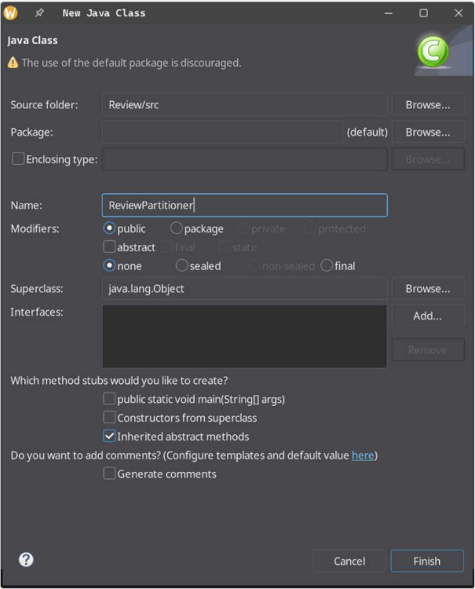
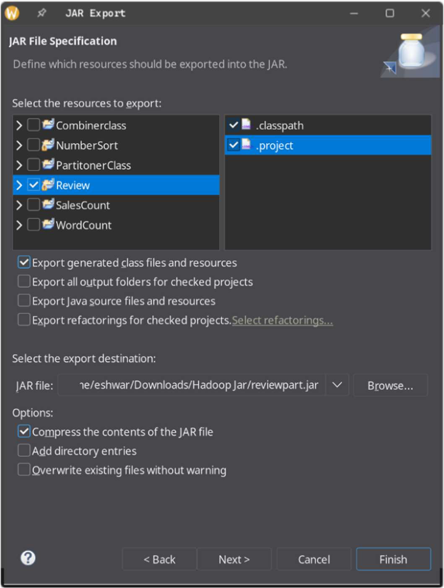
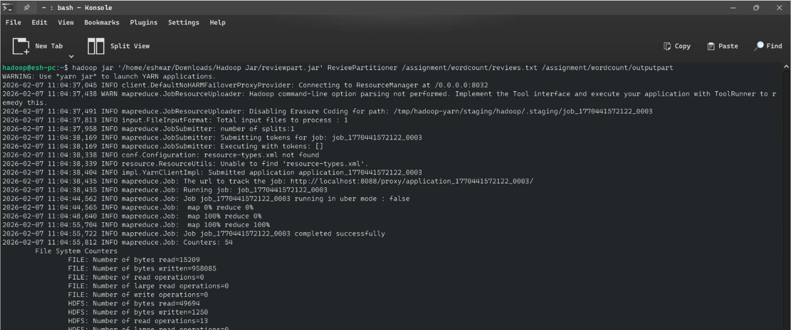
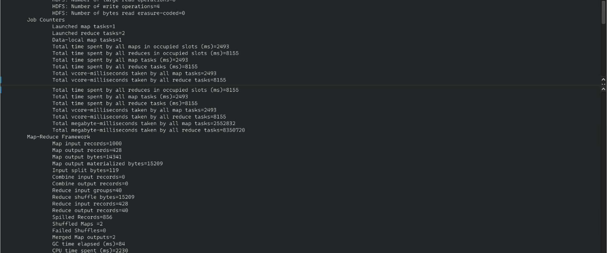
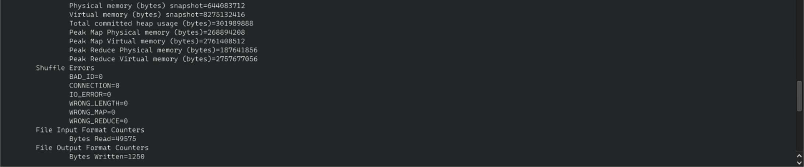
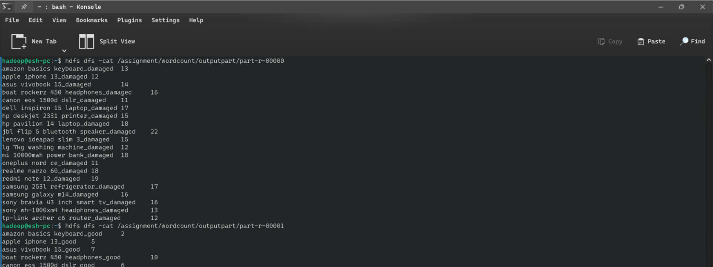
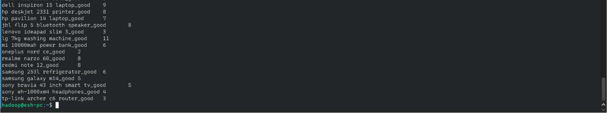

# 📊 Product Sentiment Partition Analysis — Hadoop MapReduce Partitioner


---

## 📌 Overview

This project extends the basic MapReduce WordCount approach by introducing a **Custom Partitioner** to perform **product-level sentiment analysis**. Customer reviews are classified into two sentiment buckets — **negative ("damaged")** and **positive ("good")** — and routed to separate output files via Hadoop's partitioning mechanism.

This pattern mirrors enterprise-scale **sentiment routing pipelines** used by e-commerce giants to maintain dual streams of positive and negative customer feedback for real-time quality dashboards.

---

## 🎯 Objective

- Implement a **custom Partitioner** in Hadoop MapReduce.
- Route "damaged" sentiment keys to `part-r-00000` (Reducer 0).
- Route "good" sentiment keys to `part-r-00001` (Reducer 1).
- Count and compare negative vs positive review volume per product.
- Demonstrate parallel output generation via multiple reducers.

---

## 🌐 Real-World Use Case

| Industry | Application |
|---|---|
| 🛒 E-Commerce | Dual-feed sentiment pipeline (positive vs negative) |
| 📦 Logistics | Separate routing of damage-related feedback |
| 📣 Marketing | Identify products suitable for promotional campaigns |
| 🏭 Manufacturing | Quality control trigger based on negative-feedback ratio |
| 📊 Analytics | Side-by-side sentiment comparison dashboards |

---

## 🛠️ Technologies Used

| Technology | Version | Purpose |
|---|---|---|
| Apache Hadoop | 3.4.1 | Distributed processing framework |
| Java | 17 | MapReduce program |
| HDFS | 3.4.1 | Distributed input/output storage |
| YARN | 3.4.1 | Resource management |
| Eclipse IDE | 2024 | Development + JAR packaging |

---

## 🧠 Hadoop Ecosystem Concepts

- **Custom Partitioner** — Overrides `getPartition()` to route keys to specific reducers.
- **Multiple Reducers** — `setNumReduceTasks(2)` creates two parallel reduce processes.
- **Compound Keys** — Using `ProductName_sentiment` as the map output key.
- **Parallel Output Files** — `part-r-00000` and `part-r-00001` generated simultaneously.
- **Shuffle & Sort** — Intermediate keys sorted and grouped before reduce.

---

## 📂 Repository Structure

```
Product-Sentiment-Partition-Analysis/
├── src/
│   └── ReviewPartitioner.java   # Mapper, Reducer, Partitioner, Driver
├── data/
│   └── reviews.txt              # Input dataset (1000 records)
├── output/
│   ├── part-r-00000.txt         # Negative ("damaged") sentiment counts
│   └── part-r-00001.txt         # Positive ("good") sentiment counts
├── screenshots/
│   ├── eclipse_code.png
│   ├── jar_export.png
│   ├── mapreduce_execution.png
│   └── output_both_partitions.png
└── run_job.sh
```

---

## 📋 Dataset

| Field | Description |
|---|---|
| `ProductName` | Name of the electronic product |
| `Review` | Customer review text |

Same 1,000-record Kaggle dataset as Project 1. Reviews with neither "damaged" nor "good" are discarded by the mapper.

---

## 🏗️ Architecture / Workflow

```
┌─────────────────────────────────────────────────────────────┐
│                        INPUT (HDFS)                          │
│                /assignment/wordcount/reviews.txt             │
└──────────────────────────┬──────────────────────────────────┘
                           │
                    ┌──────▼──────┐
                    │   MAPPER    │
                    │             │
                    │  "damaged"  │──► emit (product_damaged, 1)
                    │    "good"   │──► emit (product_good, 1)
                    └──────┬──────┘
                           │ Shuffle & Sort
                    ┌──────▼──────────────────┐
                    │  CUSTOM PARTITIONER      │
                    │                          │
                    │  key ends "_damaged" ──► Reducer 0
                    │  key ends "_good"    ──► Reducer 1
                    └─────┬──────────┬────────┘
                          │          │
               ┌──────────▼──┐  ┌───▼──────────┐
               │  REDUCER 0  │  │  REDUCER 1   │
               │  (damaged)  │  │   (good)     │
               └──────┬──────┘  └──────┬───────┘
                      │                │
             part-r-00000        part-r-00001
         (negative feedback)  (positive feedback)
```

---

## 💻 Code Explanation

### Custom Partitioner Logic

```java
public static class SentimentPartitioner extends Partitioner<Text, IntWritable> {
    @Override
    public int getPartition(Text key, IntWritable value, int numReduceTasks) {
        if (numReduceTasks == 0) return 0;
        return key.toString().endsWith("_damaged") ? 0 : 1;
    }
}
```

- Keys ending with `_damaged` → **Reducer 0** → `part-r-00000`
- All other keys (i.e., `_good`) → **Reducer 1** → `part-r-00001`

### Job Configuration

```java
job.setPartitionerClass(SentimentPartitioner.class);
job.setNumReduceTasks(2);  // Critical: must match partitioner logic
```

---

## 🚀 Step-by-Step Execution

### Step 1 — Start Hadoop

```bash
su - hadoop
start-dfs.sh && start-yarn.sh
jps
```

### Step 2 — Submit Job

```bash
hadoop jar ~/Downloads/Hadoop_Jar/reviewpart.jar ReviewPartitioner \
  /assignment/wordcount/reviews.txt \
  /assignment/wordcount/outputpart
```

### Step 3 — View Both Outputs

```bash
# Negative reviews (damaged)
hdfs dfs -cat /assignment/wordcount/outputpart/part-r-00000

# Positive reviews (good)
hdfs dfs -cat /assignment/wordcount/outputpart/part-r-00001
```

---

## 📸 Screenshots

### 1. Creating the ReviewPartitioner Class in Eclipse


### 2. Partitioner Code in Eclipse IDE


### 3. Exporting JAR File


### 4. MapReduce Job Execution (2 Reducers)


### 5. Job Counters


### 6. Job Statistics


### 7. Output — Damaged Reviews (part-r-00000)


### 8. Output — Good Reviews (part-r-00001)



## 📤 Output Explanation

**part-r-00000 (Negative — "damaged"):**
```
amazon basics keyboard_damaged    13
boat rockerz 450 headphones_damaged  16
dell inspiron 15 laptop_damaged   17
jbl flip 5 bluetooth speaker_damaged  22
hp pavilion 14 laptop_damaged     18
```

**part-r-00001 (Positive — "good"):**
```
amazon basics keyboard_good    2
boat rockerz 450 headphones_good  7
dell inspiron 15 laptop_good   9
jbl flip 5 bluetooth speaker_good  8
hp pavilion 14 laptop_good     7
```

**Key Insight:** Products with high damaged-to-good ratios (e.g., JBL Flip 5: 22 damaged vs 8 good) warrant urgent quality review.

---

## 📈 Scalability

The two-reducer design doubles throughput for sentiment classification. For enterprise scale:
- Use `N` reducers for `N` sentiment categories.
- Combine with Apache Kafka for real-time review streaming.
- Feed output directly into Elasticsearch for live dashboard updates.

---

## 🎓 Learning Outcomes

- ✅ Designed and implemented a custom Hadoop `Partitioner`.
- ✅ Configured multiple reducers for parallel output generation.
- ✅ Used compound keys for multi-attribute MapReduce output.
- ✅ Performed product-level sentiment classification at scale.

---

## 🔮 Future Improvements

- 🤖 Integrate NLP sentiment scoring (VADER/TextBlob) as a pre-processing step.
- 📊 Add a Combiner to reduce network shuffle for large datasets.
- 🔢 Extend to N-sentiment classification (very positive, positive, neutral, negative, very negative).
- ⚡ Replace with Apache Spark MLlib for advanced sentiment modelling.

---

## Author

**Eshwar G**

---

## 📄 License

MIT License — Free to use, modify, and distribute with attribution.
