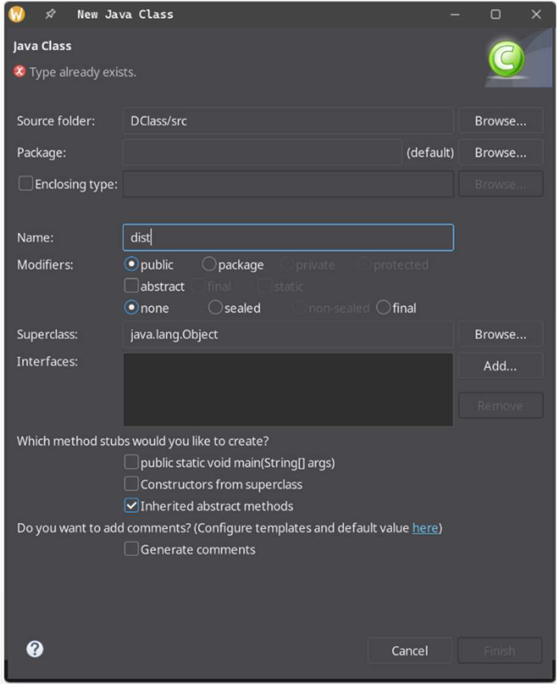
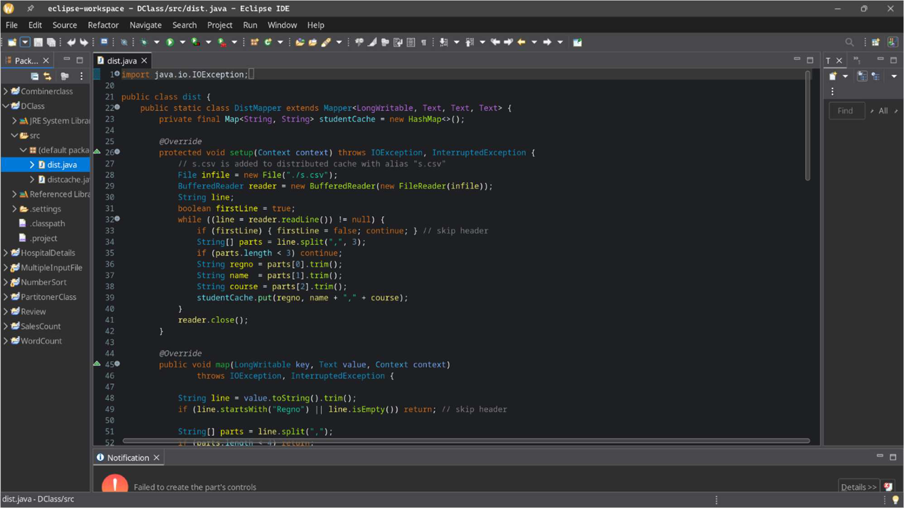
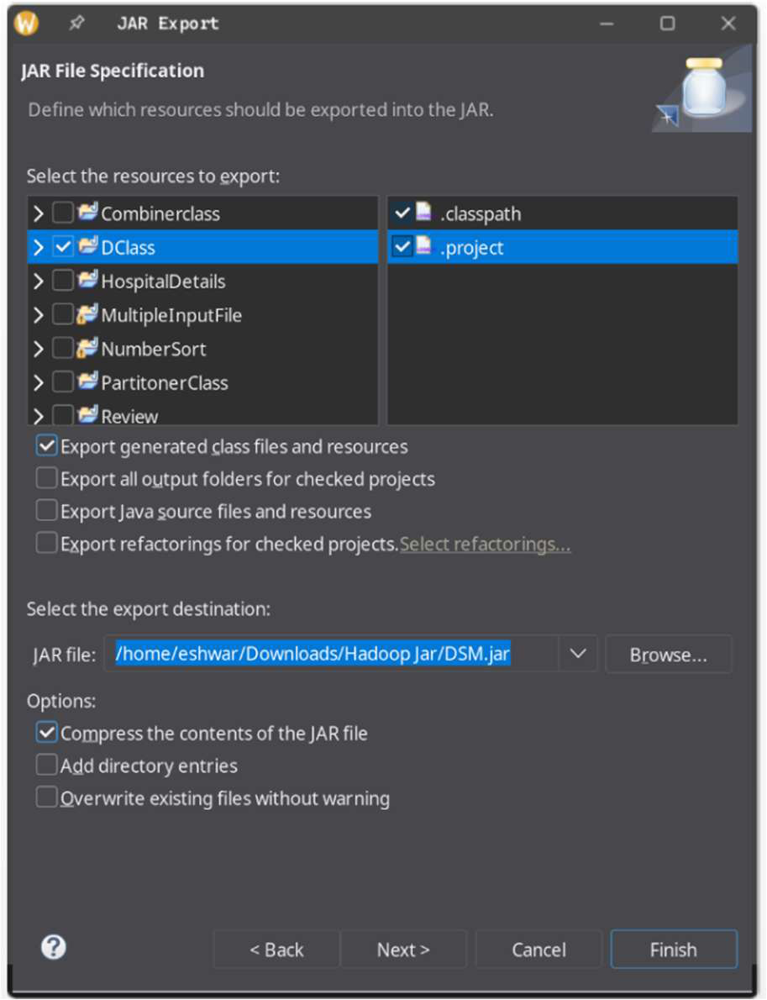
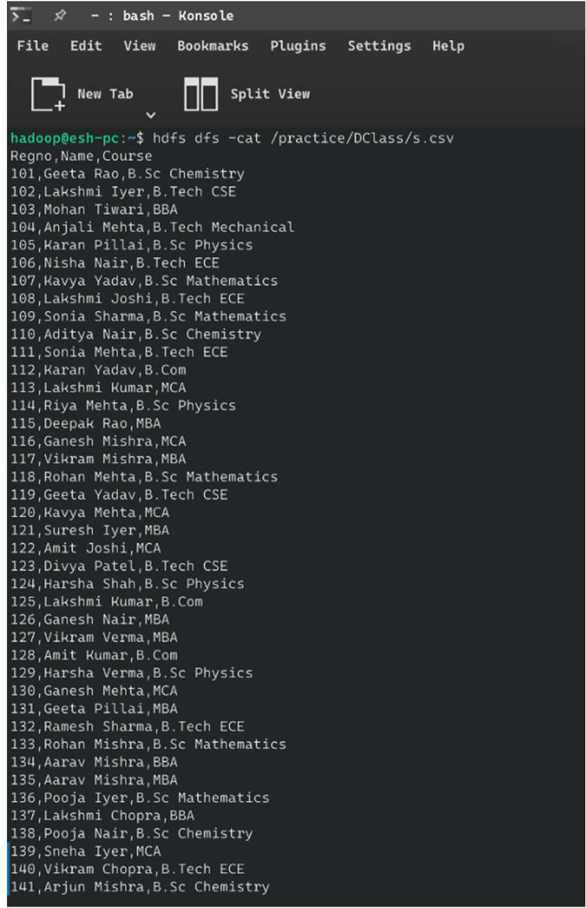
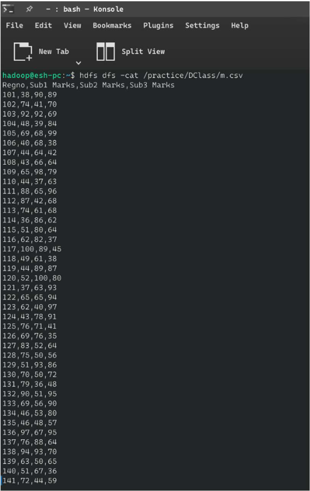
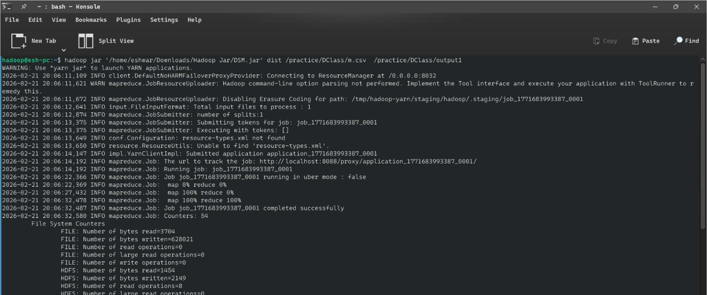
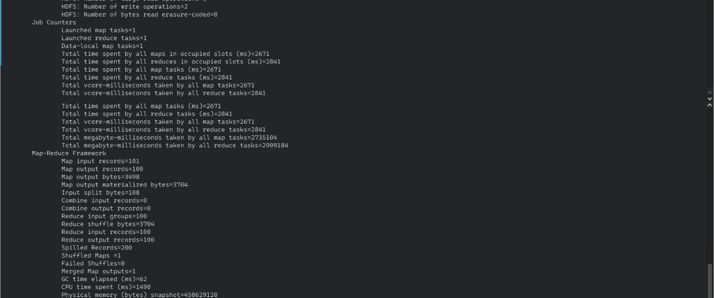
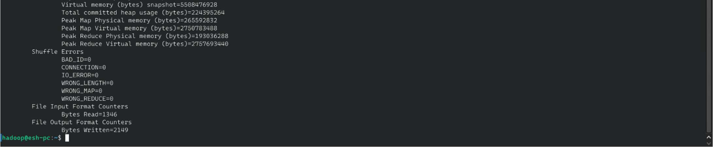
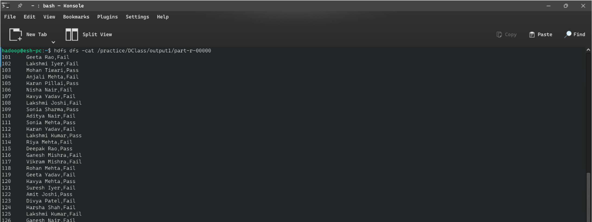
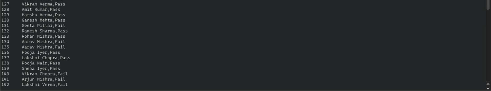

# 🎓 Student Performance Analysis — Hadoop Distributed Cache (Map-Side Join)


---

## 📌 Overview

This project implements a **Hadoop MapReduce Map-Side Join** using the **Distributed Cache** mechanism to process student examination results. The program joins student registration data (`s.csv`) with subject marks (`m.csv`) and computes Pass/Fail outcomes for each student based on a 50-mark threshold across three subjects.

By loading the smaller student information file into the **Distributed Cache**, all mapper nodes access the data locally — eliminating expensive network shuffles and demonstrating an efficient **broadcast join** pattern used at scale in education management systems.

---

## 🎯 Objective

- Implement **Distributed Cache** in Hadoop MapReduce for small dataset broadcasting.
- Perform a **Map-Side Join** between student info and marks datasets.
- Compute Pass/Fail for 100 students across 3 subjects.
- Demonstrate the performance advantage of Map-Side Join over Reduce-Side Join.
- Avoid reduce-side data transfer for small reference datasets.

---

## 🌐 Real-World Use Case

| Scenario | Application |
|---|---|
| 🎓 University ERP | Bulk result processing at semester end |
| 📋 Board Examinations | State-level result computation across thousands of schools |
| 🏢 Corporate Training | Employee certification pass/fail at scale |
| 📊 EdTech Platforms | Continuous assessment analytics per cohort |
| 🔔 Automated Alerts | Trigger notifications for at-risk students |

---

## 🛠️ Technologies Used

| Technology | Version | Purpose |
|---|---|---|
| Apache Hadoop | 3.4.1 | Distributed processing |
| Java | 17 | MapReduce implementation |
| Distributed Cache API | 3.4.1 | Broadcasting small reference dataset |
| HDFS | 3.4.1 | Dataset storage |
| Eclipse IDE | 2024 | Development and JAR packaging |

---

## 🧠 Hadoop Ecosystem Concepts

- **Distributed Cache** — Copies a file from HDFS to every mapper node's local filesystem before job execution.
- **Map-Side Join** — Join performed entirely within the `setup()` method, zero reducer communication needed for the lookup.
- **HashMap Lookup** — O(1) in-memory join using student registration number as key.
- **`addCacheFile(URI)`** — Driver API to register the cached file.
- **File Aliasing** — `#s.csv` alias makes the file accessible as `./s.csv` on each node.

---

## 📂 Repository Structure

```
Student-Performance-Distributed-Cache-Analysis/
├── src/
│   └── dist.java              # DistMapper, DistReducer, Driver
├── data/
│   ├── s.csv                  # Student info (100 records) — goes to Distributed Cache
│   └── m.csv                  # Subject marks (100 records) — primary HDFS input
├── output/
│   └── part-r-00000.txt       # Pass/Fail results
├── screenshots/
│   ├── input_data.png         # Both datasets in HDFS
│   ├── distributed_cache.png  # Cache setup in driver
│   ├── execution.png          # MapReduce job run
│   └── output.png             # Pass/Fail results
└── run_job.sh
```

---

## 📋 Dataset Explanation

### Dataset 1: `s.csv` — Student Information (Distributed Cache)
| Column | Description | Example |
|---|---|---|
| Regno | Registration number (join key) | 101 |
| Name | Student full name | Geeta Rao |
| Course | Enrolled programme | B.Sc Chemistry |

### Dataset 2: `m.csv` — Subject Marks (HDFS Input)
| Column | Description | Example |
|---|---|---|
| Regno | Join key | 101 |
| Sub1 Marks | Subject 1 score (0–100) | 38 |
| Sub2 Marks | Subject 2 score (0–100) | 90 |
| Sub3 Marks | Subject 3 score (0–100) | 89 |

**Pass Condition:** `Sub1 ≥ 50 AND Sub2 ≥ 50 AND Sub3 ≥ 50`

---

## 🏗️ Architecture / Workflow

```
         HDFS                     Distributed Cache
┌──────────────────┐         ┌────────────────────────┐
│      m.csv       │         │        s.csv           │
│  (marks — large) │         │  (student info — small) │
└────────┬─────────┘         └────────────┬───────────┘
         │                                │ addCacheFile()
         │                  ┌─────────────▼────────────┐
         │                  │  Each Mapper Node         │
         │                  │  Loads s.csv into HashMap │
         │                  │  (setup() once per node)  │
         │                  └────────────┬─────────────┘
         │                               │
  ┌──────▼────────────────────────────── ▼ ──────────┐
  │                   MAPPER                          │
  │                                                   │
  │  For each marks row:                              │
  │    • Look up student name in HashMap (O(1))       │
  │    • Emit (Regno, "Name,Course,Sub1,Sub2,Sub3")   │
  └──────────────────────┬────────────────────────────┘
                         │
                  ┌──────▼──────┐
                  │   REDUCER   │
                  │             │
                  │  Sum ≥ 50×3 │──► Pass
                  │  Else       │──► Fail
                  └──────┬──────┘
                         │
                  part-r-00000
                (Regno, Name, Pass/Fail)
```

---

## 💻 Code Explanation

### Distributed Cache Setup (Driver)

```java
// Register s.csv in Distributed Cache — aliased as "s.csv" locally
job.addCacheFile(new URI("hdfs:///practice/DClass/s.csv#s.csv"));
```

### Loading Cache in `setup()`

```java
@Override
protected void setup(Context context) throws IOException, InterruptedException {
    File cachedFile = new File("./s.csv");  // Available locally on each node
    BufferedReader reader = new BufferedReader(new FileReader(cachedFile));
    String line;
    boolean isHeader = true;
    while ((line = reader.readLine()) != null) {
        if (isHeader) { isHeader = false; continue; }
        String[] parts = line.split(",", 3);
        studentCache.put(parts[0].trim(), parts[1].trim() + "," + parts[2].trim());
    }
    reader.close();
}
```

### Pass/Fail Determination (Reducer)

```java
String result = (sub1 >= 50 && sub2 >= 50 && sub3 >= 50) ? "Pass" : "Fail";
context.write(key, new Text(name + "," + result));
```

---

## 🚀 Step-by-Step Execution

### Step 1 — Start Hadoop

```bash
su - hadoop
start-dfs.sh && start-yarn.sh
jps
```

### Step 2 — Upload Files to HDFS

```bash
# Upload s.csv to Distributed Cache location
hdfs dfs -mkdir -p /practice/DClass
hdfs dfs -put data/s.csv /practice/DClass/

# Upload m.csv as primary job input
hdfs dfs -put data/m.csv /practice/DClass/
```

### Step 3 — Run the Job

```bash
hadoop jar ~/Downloads/Hadoop_Jar/DSM.jar dist \
  /practice/DClass/m.csv \
  /practice/DClass/output1
```

### Step 4 — View Results

```bash
hdfs dfs -cat /practice/DClass/output1/part-r-00000
```

---

## 📸 Screenshots

### 1. Creating the Distributed Cache Class in Eclipse


### 2. Distributed Cache Code in Eclipse IDE


### 3. Exporting JAR File


### 4. Student Information Dataset (s.csv)


### 5. Subject Marks Dataset (m.csv)


### 6. MapReduce Job Execution


### 7. Job Counters


### 8. Job Statistics


### 9. Pass/Fail Output Results


### 10. Full Pass/Fail Output



## 📤 Output Explanation

```
101    Geeta Rao,Fail      ← Sub1 = 38 (below 50)
102    Lakshmi Iyer,Fail   ← Sub2 = 41 (below 50)
103    Mohan Tiwari,Pass   ← All ≥ 50
109    Sonia Sharma,Pass
111    Sonia Mehta,Pass
113    Lakshmi Kumar,Pass
122    Amit Joshi,Pass
128    Amit Kumar,Pass
```

**Key Insights:**
- Students failing a single subject cause a full Fail (strict AND condition).
- Results can be filtered per course/department for academic counselling.
- High Fail rates in specific subjects indicate curriculum or teaching gaps.

---

## ⚡ Map-Side Join vs Reduce-Side Join

| Factor | Map-Side (Distributed Cache) | Reduce-Side |
|---|---|---|
| Network Shuffle | ❌ None for cached dataset | ✅ Full shuffle |
| Speed | ⚡ Much faster | 🐢 Slower |
| Memory | Requires RAM for cached file | Disk-based |
| Use Case | Small reference datasets | Large-large joins |
| Scalability | Limited by node RAM | Unlimited |

---

## 🎓 Learning Outcomes

- ✅ Implemented Hadoop Distributed Cache for small dataset broadcasting.
- ✅ Performed Map-Side Join using `setup()` and `HashMap`.
- ✅ Avoided expensive reducer shuffle for reference lookups.
- ✅ Applied Pass/Fail academic evaluation at distributed scale.
- ✅ Compared trade-offs between join strategies.

---

## 🔮 Future Improvements

- 📊 Add subject-wise performance analytics (average, median per course).
- 🎯 Implement grade computation (A, B, C, D, F) instead of binary Pass/Fail.
- ⚡ Migrate to Apache Spark for in-memory processing of larger datasets.
- 📧 Integrate email notification system for result delivery.

---

## 👥 Authors

| Name | Roll No | Program |
|---|---|---|
| **Eshwar G** | 2582420 | MSDA — 3rd Trimester |
| **Shivani R** | — | MSDA — 3rd Trimester |

---

## 📄 License

MIT License — Free to use, modify, and distribute with attribution.
