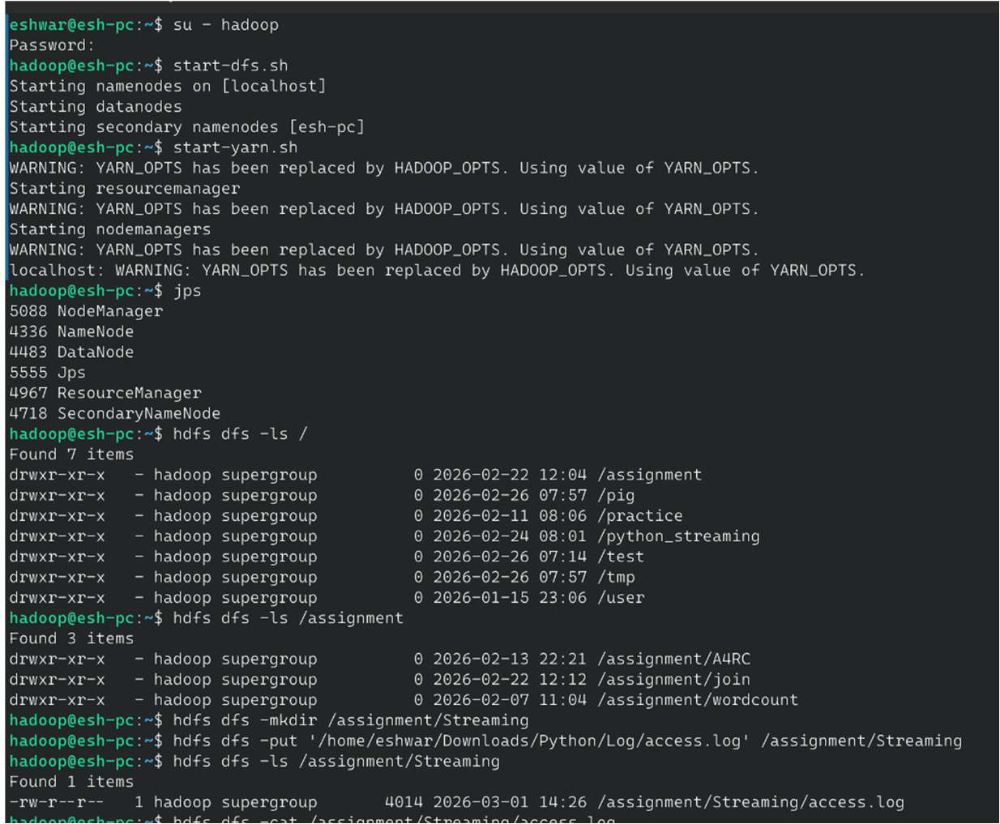
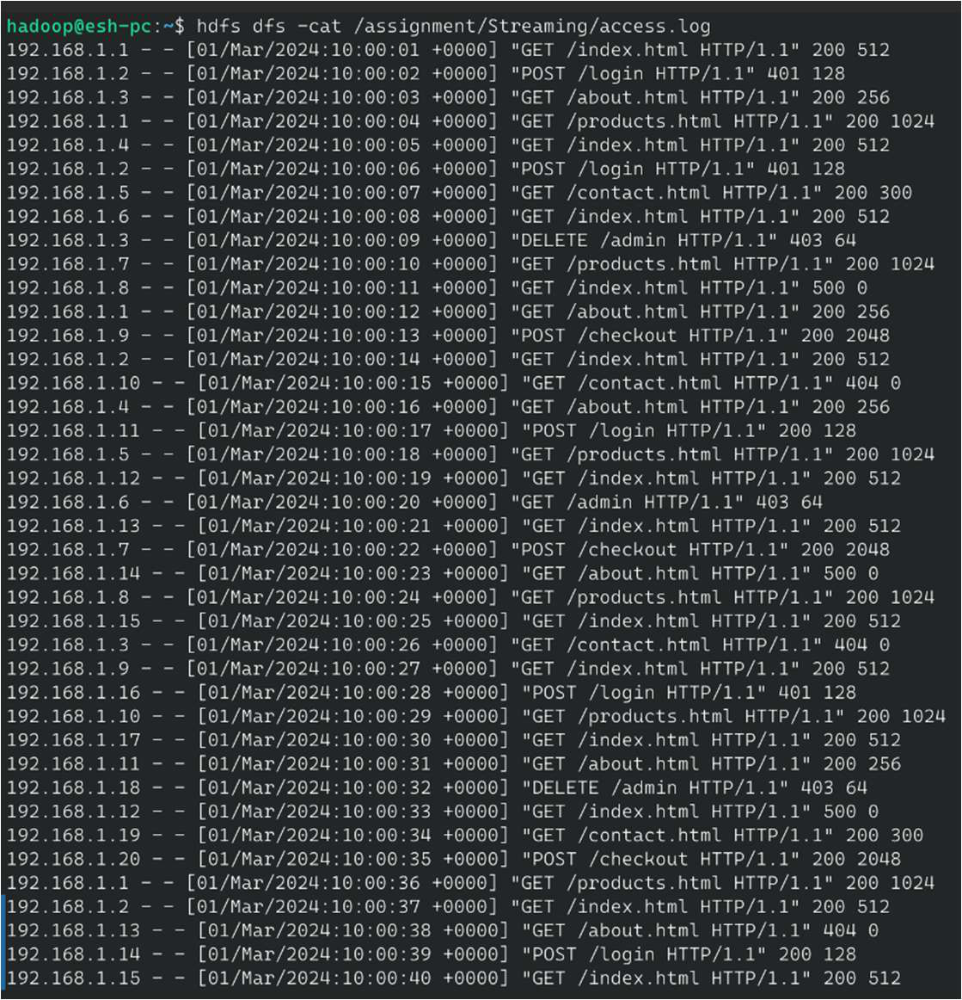
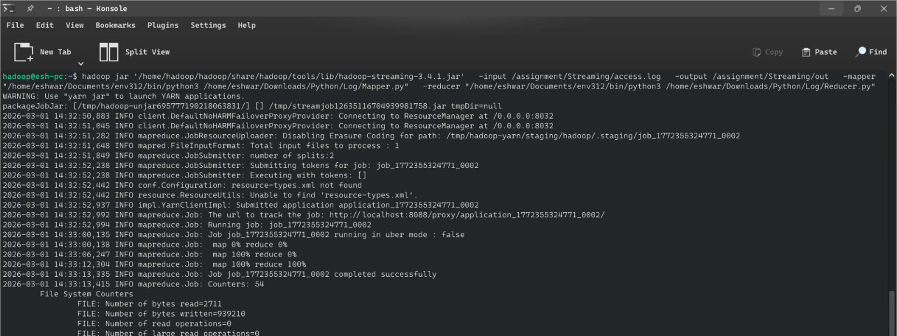
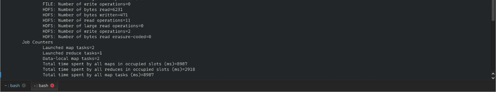
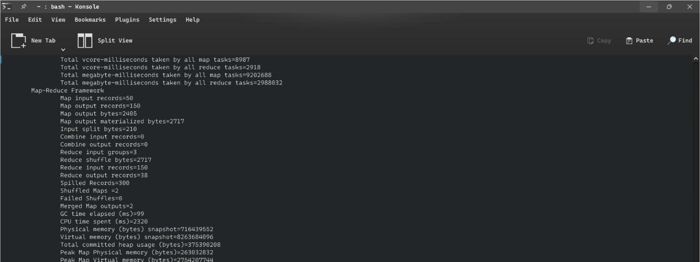
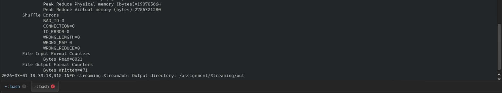
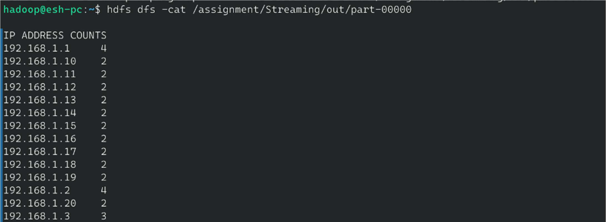

# 🌐 Web Server Log Analytics — Python Hadoop Streaming


---

## 📌 Overview

This project implements a **Python-based Hadoop Streaming** pipeline to analyze Apache web server access logs. Unlike traditional MapReduce in Java, **Hadoop Streaming** enables any scripting language (Python, Ruby, Shell) to act as mapper and reducer via stdin/stdout, making it highly accessible for data engineers and analysts.

The pipeline extracts three analytical dimensions from each log entry — **IP traffic patterns**, **URL popularity**, and **HTTP status code distribution** — providing a comprehensive view of web server health and user behaviour.

---

## 🎯 Objective

- Implement MapReduce using **Python and Hadoop Streaming** (no Java required).
- Parse **Apache Combined Log Format** at scale.
- Identify top IP addresses (bot/power user detection).
- Rank URLs by visit count (content popularity).
- Classify HTTP status codes (server health monitoring).
- Demonstrate language-agnostic Hadoop processing.

---

## 🌐 Real-World Use Case

| Scenario | Insight |
|---|---|
| 🔐 Security | Detect IPs with excessive requests (DDoS/bot detection) |
| 📈 Marketing | Identify most-visited landing pages for A/B testing |
| 🚨 Ops Alerts | Monitor 5xx error spikes for incident response |
| 🛒 E-Commerce | Track checkout URL drop-off rates |
| 📊 BI Reporting | Feed server metrics into Grafana/Kibana dashboards |

---

## 🛠️ Technologies Used

| Technology | Purpose |
|---|---|
| Apache Hadoop 3.4.1 | Distributed YARN execution |
| Hadoop Streaming JAR | Language-agnostic MapReduce bridge |
| Python 3.12 | Mapper and reducer scripts |
| HDFS | Input/output file storage |
| Apache Log Format | Standard web server log structure |

---

## 🧠 Hadoop Ecosystem Concepts

- **Hadoop Streaming** — Passes data through stdin/stdout between any executable and YARN.
- **Multi-Key Emission** — Single log line emits 3 different analytical keys (IP, URL, STATUS).
- **In-Reducer Aggregation** — Accumulates all counts before printing sorted output.
- **Python Virtual Environment** — Manages Python dependencies on Hadoop nodes.
- **HDFS File Ingestion** — `hdfs dfs -put` for uploading log files.

---

## 📂 Repository Structure

```
Web-Server-Log-Analytics-Hadoop-Streaming/
├── src/
│   ├── mapper.py              # Parses log lines, emits (category, key, 1)
│   └── reducer.py             # Aggregates counts, formats 3-section output
├── data/
│   └── access.log             # Sample Apache access log (50 requests)
├── output/
│   └── part-00000.txt         # IP, URL, and status code analytics
├── screenshots/
│   ├── hdfs_setup.png         # HDFS directory and log upload
│   ├── streaming_execution.png # Hadoop Streaming job run
│   └── output_analytics.png   # Final 3-section output
└── run_streaming_job.sh
```

---

## 📋 Log Format Explained

```
192.168.1.1 - - [01/Mar/2024:10:00:01 +0000] "GET /index.html HTTP/1.1" 200 512
│           │   │                            │                            │   │
│           │   │                            │                            │   └── Response size (bytes)
│           │   │                            │                            └────── HTTP Status Code
│           │   │                            └─────────────────────────────────── Request line
│           │   └──────────────────────────────────────────────────────────────── Timestamp
│           └──────────────────────────────────────────────────────────────────── Ident / Auth
└──────────────────────────────────────────────────────────────────────────────── Client IP
```

**Field positions (0-indexed, whitespace split):**
- `parts[0]` → IP address
- `parts[6]` → URL path
- `parts[8]` → HTTP status code

---

## 🏗️ Architecture / Workflow

```
┌──────────────────────────────┐
│     access.log (HDFS)        │
│  50 Apache log lines          │
└──────────────┬───────────────┘
               │ Hadoop Streaming reads lines
               ▼
┌──────────────────────────────┐
│        mapper.py (stdin)     │
│                              │
│  For each log line:          │
│  • Extract IP, URL, STATUS   │
│  • Emit 3 key-value pairs    │
│                              │
│  IP\t192.168.1.1\t1         │
│  URL\t/index.html\t1        │
│  STATUS\t200\t1             │
└──────────────┬───────────────┘
               │ Shuffle & Sort (Hadoop YARN)
               ▼
┌──────────────────────────────┐
│       reducer.py (stdin)     │
│                              │
│  Accumulate counts per key   │
│  Print 3 analytical sections │
└──────────────┬───────────────┘
               │
         part-00000.txt
      (IP / URL / STATUS counts)
```

---

## 💻 Code Explanation

### Mapper (`mapper.py`)

```python
def parse_log_line(line):
    parts = line.split()
    ip     = parts[0]   # Client IP
    url    = parts[6]   # Requested URL
    status = parts[8]   # HTTP response code
    return ip, url, status

# Emit one line per dimension
print('IP\t%s\t%s'     % (ip, 1))
print('URL\t%s\t%s'    % (url, 1))
print('STATUS\t%s\t%s' % (status, 1))
```

### Reducer (`reducer.py`)

```python
counts = {}
for line in sys.stdin:
    category, key, count = line.split('\t', 2)
    counts[(category, key)] = counts.get((category, key), 0) + int(count)

# Print grouped output
for section in ['IP', 'URL', 'STATUS']:
    print(f"\n {section} COUNTS ")
    for (cat, key), total in sorted(counts.items()):
        if cat == section:
            print('%s\t%d' % (key, total))
```

---

## 🚀 Step-by-Step Execution

### Step 1 — Start Hadoop & Set Up Directories

```bash
su - hadoop
start-dfs.sh && start-yarn.sh
jps

hdfs dfs -mkdir -p /assignment/Streaming
```

### Step 2 — Upload Log File to HDFS

```bash
hdfs dfs -put data/access.log /assignment/Streaming/
hdfs dfs -cat /assignment/Streaming/access.log
```

### Step 3 — Make Scripts Executable

```bash
chmod +x src/mapper.py src/reducer.py

# Test locally before submitting to cluster
cat data/access.log | python3 src/mapper.py | sort | python3 src/reducer.py
```

### Step 4 — Run Hadoop Streaming Job

```bash
hadoop jar /home/hadoop/hadoop/share/hadoop/tools/lib/hadoop-streaming-3.4.1.jar \
  -input  /assignment/Streaming/access.log \
  -output /assignment/Streaming/out \
  -mapper  /home/eshwar/Documents/env312/bin/python3 /home/eshwar/Downloads/Python/Log/Mapper.py \
  -reducer /home/eshwar/Documents/env312/bin/python3 /home/eshwar/Downloads/Python/Log/Reducer.py
```

### Step 5 — View Output

```bash
hdfs dfs -cat /assignment/Streaming/out/part-00000
```

---

## 📸 Screenshots

### 1. Starting Hadoop & HDFS Directory Setup


### 2. Uploading access.log to HDFS


### 3. Hadoop Streaming Job Execution — Part 1


### 4. Hadoop Streaming Job Execution — Part 2


### 5. Hadoop Streaming Job Execution — Part 3


### 6. Hadoop Streaming Job Execution — Part 4


### 7. Output — IP, URL, and Status Code Counts


### 8. Output — Full Analytics Summary


## 📤 Output Explanation

```
 IP ADDRESS COUNTS
─────────────────────────────
192.168.1.1      4   ← Most active (potential bot or power user)
192.168.1.2      4
192.168.1.3      3
...

 URL COUNTS
─────────────────────────────
/index.html      16  ← Homepage — most visited
/products.html   8
/about.html      7
/contact.html    6
/login           5
/checkout        4
/admin           4   ← Admin attempts — security concern

 STATUS CODE COUNTS
─────────────────────────────
200              35  ← Successful requests (70%)
401               3  ← Unauthorised login attempts
403               4  ← Forbidden access (admin endpoint)
404               4  ← Missing pages — fix broken links
500               4  ← Server errors — requires investigation
```

**Key Findings:**
- 🔴 **192.168.1.1 & 192.168.1.2** — 4 hits each, possible automated traffic.
- 🟡 **4 × 500 errors** — server instability; check application logs.
- 🟠 **4 × 403 errors** — repeated admin access attempts; potential security threat.
- 🟢 **/index.html (16 hits)** — homepage functioning as primary entry point.

---

## 📈 Scalability

| Log Volume | Processing Time | Approach |
|---|---|---|
| 50 lines (demo) | < 1 second | Single node |
| 1GB logs | ~2 minutes | 10-node cluster |
| 1TB logs/day | ~20 minutes | 100-node cluster |
| Real-time | Milliseconds | Kafka + Spark Streaming |

---

## 🎓 Learning Outcomes

- ✅ Implemented Hadoop MapReduce in Python using Streaming API.
- ✅ Parsed Apache Combined Log Format for multi-dimensional analytics.
- ✅ Conducted IP traffic, URL popularity, and HTTP status analysis.
- ✅ Tested MapReduce pipeline locally with Unix pipes before cluster submission.
- ✅ Understood Hadoop Streaming as a language-agnostic distributed computing bridge.

---

## 🔮 Future Improvements

- 🤖 Add bot detection using IP request frequency thresholds.
- 📍 Integrate GeoIP lookup for geographic traffic visualization.
- ⚡ Migrate to Apache Spark for real-time log stream processing.
- 📊 Push output to Elasticsearch + Kibana for live server dashboards.
- 🔔 Trigger PagerDuty alerts when 5xx error rate exceeds 10%.

---

## Author

**Eshwar G**

---

## 📄 License

MIT License — Free to use, modify, and distribute with attribution.
